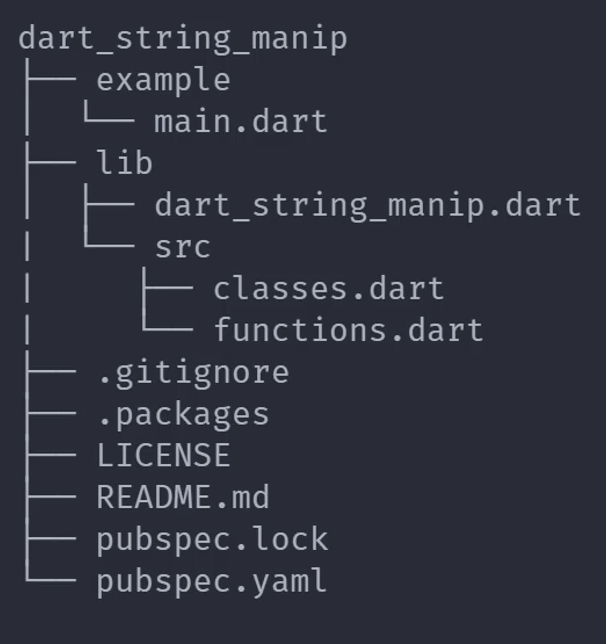

# Dart

`Dart官方文档：https://dart.dev/docs`
`Dart生态库：https://pub.dev/`
``

## 基础介绍

谷歌开发的、类型安全、面向对象的编程语言`.dart`（类似C++、Java、Python结合）

Flutter SDK包含Dart SDK

每行结束必须携带分号`;`
Dart万物皆对象，引用传递


### dart
```yaml
dart:
    -h:
    -v: # 版本
    analyze:
    compile:
    create: # 创建dart项目
    devtools:
    doc:
    fix: 
    format: # 代码格式化
    info: # dart环境信息
    pub: # dart包管理工具
        -h:
        -v:
        add:
        bump:
        cache:
        deps:
        downgrade:
        get: # 下载第三方库
        global:
        login:
        logout:
        outdated:
        publish:
        remove:
        token:
        unpack:
        upgrade:
        workspace:
    run: # 运行dart程序
    test: # 测试
```


#### pubspec.yaml
```yaml
pubspec.yaml:
    environment: # 项目环境要求
        sdk:
    dependencies: # 依赖包
    dev_dependencies:
    flutter:
        uses-material-design:
    name: # 项目名
```

dart包配置文件


## 核心内容
```yaml
dart:
    async:
        Future:
            catchError():
            then():
        Stream:
    cli:
    collection:
    convert:
        JsonDecoder:
        JsonEncoder:
        jsonDecoder():
        jsonEncoder():
    core: # 内置模块（默认导入）
        BigInt:
        Comparable:
        DateTime:
            millisecondsSinceEpoch: # 毫秒
            month:
            add():
            difference():
                inDays:
                inHours:
            isAfter():
            isAtSameMomentAs():
            isBefore():
            now():
            parse():
            utc():
        Duration: # 时间间隔
            hour:
        Enum:
            index: # 枚举索引
            values: # 所有枚举值
        Function:
        List: # 列表
            length: # 列表长度
            reversed:
            add(): # 添加元素
            addAll():
            any():
            clear():
            empty():
                growable():
            every():
            expand(): # 列表降维
            filled(): # 填充构造
            fold(): # reduce迭代计算 
            forEach(): # 迭代遍历
            insert(): # 插入元素
            insertAll():
            join(): #元素合并字符串
            map(): # 元素转换
            remove(): # 删除元素
            removeAt(): # 删除元素
            toSet():
            where():
                toList():
        Map:
            keys:
            values:
            containsKey():
            containsValue():
            putIfAbsent():
            remove():
            removeWhere():
        MapEntry:
        Match:
        Null:
        Object:
        Pattern:
        Record:
        RegExp:
        Runes:
        Set:
            first:
            last:
            add(): # 添加元素
            addAll():
            clear():
            difference(): # 差集
            intersection(): # 交集
            remove():
            toList():
            union(): # 并集
        Stream:
        String: # 字符串
            length:
            runes:
            contains():
            fromCharCodes():
            hasMatch():
            indexOf():
            isEmpty():
            padLeft(): # 左边填充
            replaceAll():
            split(): # 字符串分隔
            trim(): # 空白符去除
        StringBuffer:
        Symbol:
        Type:
        Uri:
        WeakReference:
        bool: # 布尔（不存在隐式类型转换）
        double: # 浮点数
            toInt():
        dynamic: # 动态类型
        int: # 整数
        num: # 数字类型
            compareTo(): # 数字比较
            isNaN():
            remainder(): # 余数
            round(): # 四舍五入
            toString():
            toStringAsFixed():
        print():
    developer:
    ffi:
    io:
    isolate: # 并发库
    math: # 数学库
        pi:
        max():
        min():
    typed_data:
package:
    http:
        http.dart:
            post():
    web:
```


### 数据类型
```yaml
DataTypes:
    Enum:
    Runes: # 32位字符对象
    String:
    Symbol: # 标识符
    bool:
    dynamic: # 动态类型
    int:
    num:
```

`var`：声明并初始化变量、自动类型推断
`dynamic`：声明动态类型
`const`：声明常量
`final`：声明不可变量

变量默认值：null


#### String
```dart
// 模板字符串
String str = "$xxx";

// 字符串拼接
String str = "a" + "b";
```

支持单引号、双引号、三引号（多行字符串）

默认UTF-16编码

#### Enum
```dart

```


#### List
```dart
// list声明
List list = []

// list类型限定
List list = <int>[]
```

支持扩展预算符：`...`（解构）


#### Set
```dart
// set声明
Set set = {};
```


#### Map
```dart
// Map声明
Map map = {k: v};
```


#### Symbol
```dart
// Symbol定义
Symbol symbol = #abc;
```

标识符


### 控制流程
```yaml
Control Flow:
    ..: # 对象级联操作运算符
    ?? / ??=: # 空类型判断
    ~/: # 整除（向下取整）
    const: # 常量
    dynamic: # 动态变量
    is / is!: # 类型判断
    var: # 自动类型推断
    for ...:
    for ... in ...: # 迭代遍历
    try ... catch ... finally ...: # 异常处理
```


#### 注释
```dart
// 单行注释

/* 多行注释 */

/// 文档注释
```

#### 异常处理

`throw`：抛出异常


### 函数
```dart
// 函数定义
int add(int a, int b) {
    return a + b;
}

// 匿名函数定义
var add = (int a, int b) {
    return a + b;
};

// 可选参数
int myfunc(int a, [int b]) {
    ...
}
```

类似Java的函数声明

`void main()`：入口函数

函数可嵌套定义、闭包

箭头函数、匿名函数、立即执行函数

必填参数、可选参数、命名参数、函数参数

不指定参数类型，默认dynamic


#### lambda
```dart
// 闭包函数定义
bool isOdd(n) => n % 2 == 1;
```

箭头函数


#### 异步函数
```dart
Future myfunc() async {
    var x = await xxx();
    return x;
}
```

Future实现异步函数：async函数返回Future、await用于等待Future


#### 泛型
```dart
// 定义泛型函数
T getData<T>(T value) {
    return value;
}
```


### 面向对象
```dart
class Person {
    // 属性定义
    String name = "233";
    // 默认构造函数
    Person() {}
    // 命名构造函数
    Person.empty() {}
    // 常量构造函数
    const Person() {}
    // 工厂构造函数
    factory Person() {}
    // 方法定义
    void myfunc() {}
}
```

Object为所有类的父类

`new`：类实例化

`this`：自身实例引用
`super`：父类实例引用

`static`: 静态属性、静态方法

`extends`：继承
`implements`：实现
`with`：混入

构造函数：
- 默认构造函数
- 普通构造函数
- 命名构造函数
- 常量构造函数（final字段、不能有函数体、新建常量对象使用const、不使用new）
- 工厂构造函数（无法实例化、默认拦截普通构造函数）

访问修饰符：默认共有、下划线`_`开头表示私有(包内还是可见)

getter/setter：方法前面加 get、set关键字

初始化列表：和C++一样


#### 抽象类/接口
```dart
// 声明抽象类/接口
abstract class Person {
    void info();
}
```

extends、implements

抽象类无法实例化

一个类可实现多个接口

实现接口必须实现接口的属性、方法


#### 混入
```dart
mixin Action {
    String name = "xxx";
    void getName() {}
}
```

mixin

混入类只能继承自Object
不能有构造函数
后引入的混入覆盖前面的同名属性、方法


#### 泛型
```dart
// 定义泛型类
class Person<T> {
    T value;
    void setValue(T v) {
        this.value = v;
    }
}

// 泛型限定
class Person<T extends OtherClass> {}
```

默认泛型Object


#### 元数据

@注解
- @override：重写
- @required：必填参数
- @deprecated：过期


### 模块
```dart
// 部分引入
import "xxx" show xxx;
import "xxx" hide xxx;

// 延迟引入
import "xxx" deferred as xxx;
xxx.loadLibrary(); # 执行模块加载
```

- 自定义库："xxx/xxx.dart"
- Dart SDK核心库："dart:xxx"
- 第三方库："package:xxx/xxx.dart"

每个dart文件默认都是一个库

`import`：模块导入
`library`：模块定义

`as`：定义库别名
`show`、`hide`：模块部分引入

下划线`_`开头，表示库内私有


主库、从库（用于分文件实现库）
`library`、`part`：建立主库、引入从库（主库设置）
`part of`：和主库建立联系（从库设置）
用于在主库中默认导入从库


### 并发


## 第三方库




### http
```yaml
httt/http.dart:

```

网络请求库

