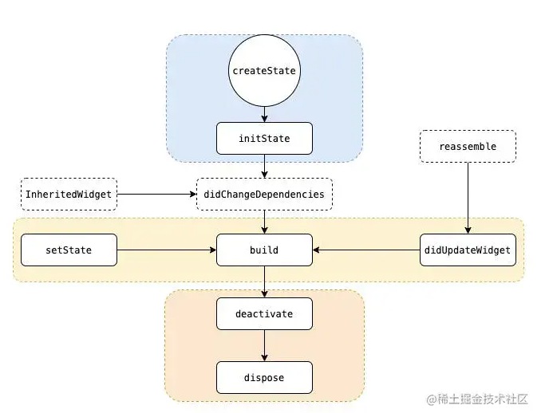

# Flutter

`Flutter官方文档：https://docs.flutter.dev/`
``


## 基础介绍

基于Dart的跨平台GUI框架

依赖JDK、Android SDK(配置ANDROID_HOME)、Flutter SDK、Android模拟器
Flutter SDK中包含了Dart SDK


资源镜像：
- PUB_HOSTED_URL:
- FLUTTER_STORAGE_BASE_URL:





- flutter第三方包安装到SDK的`.pub-cache`目录下
- flutter需要使用android studio安装ndk（原生开发库）
- App -> MaterialApp(Theme、Route) - Scaffold(AppBar) -> Container(Row、Column) -> ListView(GridView) -> Text(Image)
- 通过View视图的builder构造器，实现列表渲染
- Flutter内置的Navigator适用于全局页面切换，不适用于局部UI切换（局部切换使用IndexedStack堆叠组件切换）

### 安装目录
```yaml
flutter:
    /.pub-cache: # 下载的第三方包
        /bin:
    /bin:
        /cache:
            /dart-sdk: # dart运行sdk
                /bin:
                    /resources:
                    /snapshots:
                    /utils:
                    dart:
                /include:
                /lib:
                /pkg:
        /internal:
        /mingit:
        dart: # dart命令
        flutter: # flutter命令
    /dev:
    /docs:
    /engine:
    /examples:
    /packages:
```


### 项目结构
```yaml
flutter:
    /.dart_tool:
        /extension_discovery:
            vs_code.json:
        package_config.json: # 记录第三方包实际路径（本地）
        package_graph.json:
        version:
    /.idea:
        /libraries:
        /runConfigurations:
        modules.xml:
        workspace.xml:
    /android:
    /build:
    /ios:
        /Flutter:
        /Runner:
        /Runner.xcodeproj:
        /Runner.xcworkspace:
        .gitignore:
    /lib: # flutter主目录
        main.dart:
    /test: # 测试
    .metadata:
    analyasis_options.yaml:
    <xxx>.iml:
    pubspec.lock:
    pubspec.yaml:
```


#### pubspec.yaml
```yaml
pubspec.yaml:
    dependencies:
        flutter:
            sdk:
    description:
    dev_dependencies:
    flutter: # flutter配置
        assets: # 本地资源配置
        uses-material-design:
    name:
    version:
```


### flutter
```yaml
flutter:
    -h:
    --version:
    build:
        apk:
        appbundle:
        windows:
    channel: # flutter SDK 版本管理
        beta: # 切换beta 版本
        main:
        master:
        stable: # 切换 stable 版本 
    config:
        --enable-windows-desktop:
    create: # 创建项目
        --org: # 包名
        --platforms: # 平台
            android:
            windows:
        --template:
    devices: # 查看设备
    doctor: # 环境检测
        -v:
    driver: # 驱动
    emulator:
        --launch:
    emulators: # 所有模拟器
        --create:
        --launch:
    install: # 安装
    pub:
        outdated:
        upgrade: # 更新flutter依赖包
    run: # 运行项目
        --release:
        -d: # 指定运行设备  
            windows:
        R: # 热重载
        c:
        d:
        h:
        q:
        r:
    upgrade: # 更新flutter SDK
```


## 核心内容
```yaml
dart:
    ui:
        ColorFilter:
        FontWeight: # 字体粗细
        TextAlign:
        TextDecoration:
flutter:
    animation: # 动画库
        AnimatedBuilder: # 自动监听动画值变化，重新渲染
            animation:
            builder:
        Animation:
            value: # 动画状态值
        AnimationController: # 动画控制器
            duration: # 持续时间
            isAnimating: # 正在执行动画
            lowerBound:
            upperBound:
            value: # 动画状态值
            vsync: # 同步信号
            addListener(): # 添加动画值监听器
            addStatusListener(): # 添加动画状态监听器
            dispose(): # 释放动画资源
            forward(): # 执行动画
            reverse(): # 反转执行动画
            stop(): # 停止动画
        AnimationStatus: # 动画状态
        ColorTween: # 颜色动画
        CurvedAnimation: # 动画曲线速率
            curve:
            parent:
        Tween: # 执行动画
            begin:
            end:
            animate(): # 传入动画
                ---
    cupertinto:
    foundation:
        computed():
        debugPrint():
    gestures:
        GestureDetector: # 手势    
    material: # 组件库
        ActionChip: # 徽章
            onPress:
        AlertDialog: # 警告 弹出框
        AppBar: # 标题栏
            title: # 标题
            bottom:
        BottomAppBar: # 底部滑动窗口
        BottomNavigationBar: # 底部导航条
            items:
        ButtonBar: # 按钮组
        ButtonTheme: # 
            minWidth:
        Card: # 卡片
        Checkbox: # 复选框
            onChanged:
            value:
        CheckboxListTile: # 复选框 标签
        Chip: # 徽章
            label:
        ChoiceChip: # 徽章
        CircleAvatar: # 圆形头像
        Colors:
        DataCell: # 数据单元格
        DataColumn: # 数据列
        DataRow: # 数据行
            cells:
        DataTable: # 数据表
        DataTableSource: # 数据表 数据源
            getRow():
        DefaultTabController:
        Divider: # 分隔线
        Drawer:
        DrawerHeader:
        ElevatedButton: # 阴影 按钮
        ExpansionPanel: # 收缩面板
            body:
            headerBuilder:
            isExpanded:
        ExpansionPanelList: # 收缩面板列表
            expansionCallback:
        FilterChip: # 徽章
        FlatButton:
            child:
            onPressed:
            shape: # 形状
        FloatingActionButton: # 浮动按钮
            child:
            onPressed:  
        Hero:
            tag:    
        IconButton:
        Icons:
        InkWell:
        InputBorder:
        InputDecoration: # 装饰 输入框
            border:
            filled:
            hintText:
            icon:
            labelText:
        ListTile: # 列表项
            leading:
            subtitle:
            title:
        Material: # Material样式
        MaterialApp: # 主应用，核心组件，携带路由
            darkTheme:
            debugShowCheckedModeBanner:
            home: # 应用主页
            initialRoute: # 初始路由
            onGenerateRoute: # 动态路由生成
            onUnknownRoute: # 缺省路由
            routes: # 路由表
            theme: # 样式主题
            title: # 标题
        MaterialPageRoute: # 路由页面
        MediaQuery: # 媒体查询
            size:
                height:
                width:
            of():
        Opacity: # 透明度
        OutlinedButton: # 边框 按钮
        PageRouteBuilder:
            pageBuilder: # 支持自定义路由动画
        PaginatedDataTable: # 分页 数据表
        PopupMenuButton: # 弹出菜单 按钮
            itemBuilder:
            onSelected:
        PopupMenuItem: # 弹出菜单项
        Radio: # 单选按钮
            groupValue:
        RadioListTile:
        RasiedButton:
            child:
            onPressed:
        Scaffold: # 脚手架组件，带底部导航，标题栏
            appBar: # 顶部导航条
            body: # 页面主体
            bottomNavigationBar: # 底部导航条
            drawer: # 左侧抽屉
            endDrawer:
            floatingActionButton: # 右下角浮动按钮
            floatingActionButtonLocation: # 浮动按钮位置
            of():
            showSnakeBar():
        ScaffoldState:
            showBottomSheet(): # 底部滑动窗口
        SimpleDialog: # 简单弹出框
        SimpleDialogOption: # 弹出框选项
        Slider: # 滑动选择
            onChanged:
        SliverAppbar:
        SnackBar: # 底部消息提示
        SnackBarAction:
        Step: # 具体步骤
            content:
            isActive:
            subtitle:
            title:
        Stepper: # 步骤
            onStepCancel:
            onStepContinue:
            onStepTapped:
            steps:
        Switch: # 开关按钮
        SwitchListTile:
        Tab:
        TabBarView:
        TextButton: # 文本 按钮
        TextField: # 文本 输入框
            controller:
            decoration:
            onChanged:
            onSubmitted:
        TextFormField: # 表单 输入框
            onSaved:
            validator: # 表单 校验
        Theme: # 主题  
            data: # 主题数据
            copyWith(): # 主题继承，可修改
            of(): # 根据context上下文获取当前theme主题
        ThemeData: # 主题数据
            accentColor:
            brightness:
            buttonTheme:
            canvasColor:
            cardTheme:
            primaryColor:
            primarySwatch:
            textTheme:
        Transform: # 形变
        UserAccountsDrawerHeader:
        showDatePicker(): # 日期选择
        showDialog(): # 对话框
            builder:
        showModalBottomSheet(): # 底部滑动窗口
        showTimePicker(): # 日期选择
    painting: # 样式库
        Alignment: # 对齐
        AssetImage: # 本地图片
        Border: # 边框
            all():
                color:
                width:
        BorderRadius: # 边框圆角
            circular():
        BorderSide:
        BoxDecoration: # 盒子装饰
            border: # 边框
        BoxFit: # 盒子填充
            contain:
        BoxShadow: # 盒子阴影
        BoxShape: # 盒子形状
        DecorationImage: # 装饰图片
        EdgeInsets: # 边距
            all():    
        ImageRepeat:
        NetworkImage: # 网络图片
        RadialGradient: # 径向渐变
        RoundedReatangleBorder: # 圆角矩形
        StadiumBorder: # 椭圆边框
        TextOverflow: # 文字溢出
        TextSpan:
        TextStyle: # 文字样式
            color:
            fontFamily:
            fontSize:    
            fontWeight:
        window: # 窗口实例
            physicalSize:
                height:
                width:
    physics:
    rendering:
        MainAxisAlignment:
    scheduler:
    semantics:
    services: # 服务
        rootBundle: # assets资源
            loadString():
    widgets: # 控件库（默认导入）
        Align: # 排列
            alignment:
        AnimatedWidget:
        AspectRatio: # 宽高比
        BottomNavigationBarItem:

        BoxScrollView:
        BuildContext: # 控件构建上下文
        Center: # 居中排列
            child:
        ClipRect: # 矩形裁剪
        ClipRRect: # 圆角裁剪
        Column: # 垂直排列
            children:
            crossAxisAlignment: # 交叉轴排列
            mainAxisAlignment: # 主轴排列
        ConstrainedBox: # 约束盒子
        Container: # 容器（大小，边框，边距）
            decoration: # 盒子装饰
            child:
            margin: # 外边距
            padding: # 内边距
            transform: # 变换
        CustomScrollView: # 自定义 滚动视图
            slivers: # 自定义 sliver
        Divider:
        Expanded: # 弹性填充剩余
            flex: # 填充占比
        FadeInImage:
            placeholder:
        Flex: # 弹性布局
            direction: # 方向
        Flexible: # 弹性占比
        Form: # 表单
        FormState: # 表单状态
            save(): # 触发 保存
            validate(): # 触发 校验
        FutureBuilder: # Suspense
        GlobalKey: # 全局key
            currentState:
        GridView: # 网格视图
            children:
            gridDelegate: # 网格实现代理
            builder():
                gridDelegate:
                itemBuilder:    
            count():
            extend():
        Icon: # 图标
        IconData: # 图标数据
        Image: # 图片
            alignment:
            color:
            colorBlendMode:
            fit:
            height:
            image:
            repeat:
            width:
            asset():
            network():
        IndexedStack:
            children:
            index:
        InheritedWidget: # Provider状态继承 控件基类
        Listener: # 点击事件
        ListView: # 列表视图
            children:
            controller:
            reverse:
            scrollDirection:
            builder(): # 可实现懒加载
                itemBuilder: # 
                itemCount: # 
                itemExtent:
            separated():
        Navigator: # 路由器、路由插槽
            of():
            pop():
            pushNamed():
            pushReplacementNamed():
        Padding: # 内边距
            child:
            padding:
        PageController: # PageView控制器 
        PageView: # 滚动页面视图
            onPageChanged:
        Positioned: # 绝对定位
        RichText: # 富文本
        Row: # 水平排列
            crossAxisAlignment: # 交叉轴排列
            mainAxisAlignment: # 主轴排列
            mainAxisSize: 
        ScrollController: # 滚动控制器
            offset:
            addListener():
            animateTo():
        ScrollView: # 滚动视图
        SizedBox: # 固定大小盒子（常用于做间距）
            height:
            width:
        SliverGrid: # 复杂滚动、嵌套滚动网格
            delegate: # 动态生成
            gridDelegate: # 网格属性
        SliverPadding:
        SliverSafeArea:
        Stack: # 层叠排列
            alignment:
            children:
            fit:
        State: # 状态，携带生命周期
            widget: # 有状态组件
            build(): # 控件渲染 钩子
            deactivate(): # 控件失活 钩子
            didChangeDependencies(): # 依赖更新 钩子
            didUpdateWidget(): # 状态更新 钩子
            dispose(): # 状态销毁 钩子
            initState(): # 状态初始化 钩子
            setState(): # 修改状态
        StatefulWidget: # 有状态组件基类
            createState(): # 创建状态
        StatelessWidget: # 无状态组件基类
            build():
        StreamBuilder: # 流式 构造器
        Text: # 文本
            maxLines:
            overflow:
            style: # 文本样式（颜色）
            textAlign:
            textDirection:
            textScaleFactor:
            rich():
        TextEditingController: # 输入框控制器
            text:
            addListener():
        Widget: # 控件基类
            createElement():
        Wrap:
        runApp(): # 主程序运行

provider:
    provider:
        ChangeNotifier: # 共享数据，getter/setter，能通知刷新  
            notifyListeners(): # 通知刷新
        ChangeNotifierProvider: # 共享仓库provider，依赖BuildContext
            child:    
            create: # 共享数据
        Consumer: # 消费状态数据
            builder:
            child:
        Consumer2: # 消费2个
        MultiProvider: # 多状态
            child:    
            providers:
        Provider:
            of(): # 根据BuildContext获取ChangeNotifier共享数据
        Selector:
            builder:
            child:
            selector:
            shouldRebuild:
event_bus:
    event_bus:
        EventBus:
            fire(): # 触发事件
            on(): # 
                listen(): # 事件监听
```


### 组件

- MaterialApp -> Scaffold
- Row -> Container -> Alignment -> Decoration
- ListView、ScrollView、GridView、PageView、CustomScrollView(SliverGrid)
- ConstrainedBox、SizedBox
- Stack、Positioned、Flexible


通过key引用组件State，类似useRef


#### MaterialApp

核心主应用App
- Theme：主题
- Navigator：路由
- 其他全局配置


##### Scaffold

Material Design 布局的基础骨架 Widget页面
- AppBar：顶部应用栏
- Body：主要内容区
- FloatingActionButton：悬浮按钮
- Drawer：抽屉菜单
- BottomNavigationBar：底部导航栏
- PersistentFooterButtons：


###### AppBar

顶部栏

###### Drawer

侧边栏

###### BottomNavigationBar

底部导航栏

##### Text

文本
- TextStyle控制文本样式

##### Image

图片


###### CircleAvatar

圆形头像


##### Button

- 通过ButtonStyle修改按钮样式
    - 前景色
    - 背景色
    - 阴影
    - 圆角
    - 边框
- 借助SizedBox、Expanded修改按钮大小

###### ElevatedButton

有阴影、背景色可配置的Button


###### TextButton

扁平按钮，无阴影、无边框的Button


###### OutlinedButton

有边框、无背景的Button

###### IconButton

图标按钮

##### Card

卡片
样式化Container
- 阴影
- 圆角


#### StatelessWidget

无状态组件


#### StatefulWidget

自定义状态组件
分2步创建、和Vue2的data()方法要求返回一个新对象是同一个原理


##### State

内置状态组件（定义状态、页面）


##### initState()

挂载成功钩子


##### didChangeDependencies()


##### didUpdateWidget()

##### build()

##### deactivate()

##### dispose()


#### Dialog

弹出框
通过Navigator.pop()关闭弹出框
可自定义Dialog

##### showDialog()
##### showModalBottomSheet()


##### AlertDialog
##### SimpleDialog
###### SimpleDialogOption


#### CustomPainter

自定义绘制组件

##### Canvas


#### Mixin

混入

##### SingleTickerProviderStateMixin
##### AutomaticKeepAliveClientMixin

组件状态保持

### 组件样式


Theme 会在应用的 Widget 树中向下传播，这意味着它不仅影响到全局的样式，也能在特定的局部区域中应用不同的主题。Theme向下传递


#### Animation


动画控制器(AnimationController) -> 动画曲线 -> 动画执行(Tween)
隐式动画、显式动画


##### AnimatedWidget

当 listenable 触发变化时，AnimatedWidget 会自动调用 build()

###### AnimatedBuilder
###### AnimatedContainer
```dart
AnimatedContainer(
  width: _width,
  height: _height,
  color: _color,
  duration: Duration(seconds: 1),
  curve: Curves.easeInOut,
);
```
Container动画增强版
隐式动画 Widget
不需要创建 AnimationController 或 Tween、修改 状态值（如 width、height、color 等）时，Flutter 会自动计算补间（Tween）并执行动画


###### AnimatedList

ListView动画版
- AnimatedListState


###### AnimatedDefaultTextStyle
###### AnimatedPadding
###### AnimatedPositioned
###### AnimatedSwitcher


##### Tween
```dart
// 定义动画控制器
AnimationController _controller = AnimationController(
  vsync: this,
  duration: Duration(seconds: 2),
);

// 定义动画
Animation<double> _animation = Tween<double>(begin: 0, end: 300)
    .animate(CurvedAnimation(parent: _controller, curve: Curves.easeInOut));

// 动画执行
_controller.forward();
```

显式动画、补间动画
需要配合 AnimationController 来驱动

###### AnimationController
```dart
```

###### AnimationStatus

###### FadeTransition
###### RotationTransition
###### ScaleTransition
###### SlideTransition


###### CurveTween


#### Material

##### MediaQuery

媒体查询、常用于响应式组件

##### BoxDecoration

盒子模型装饰器：
- image：

##### TextStyle

文本样式

##### ButtonStyle

按钮样式

##### Opacity

透明度

##### Transform

形变


#### Theme


主题


##### ThemeData


#### Container

##### Align

对齐子元素

###### Center

居中子元素

##### Padding

内边距

##### AspectRatio

宽高比

##### SizedBox

固定大小容器

##### Flex

弹性布局

###### Expanded

扩展元素，弹性占比（默认占满剩余空间）

##### Row

水平布局

###### Column

垂直布局

###### Wrap

换行布局

##### Stack

堆叠布局（浮动效果）
常搭配Positioned,实现位置定位


###### Positioned

固定定位布局

##### SafeArea

安全区域容器

##### FittedBox


#### ScrollView

##### CustomScrollView
##### Sliver
- SliverList: 类似于我们之前使用过的ListView;
- SliverFixedExtentList: 类似于SliverList只是可以设置滚动的高度；
- SliverGrid: 类似于我们之前使用过的GridView;
- SliverPadding: 设置Sliver的内边距，因为可能要单独给Sliveri设置内边距；
- SliverAppBar: 添加一个AppBar,,通常用来作为CustomScrollView的HeaderView;
- SliverSafeArea: 设置内容显示在安全区域（比如不让齐刘海挡住我们的内容）


##### ListView
```dart
final List<ToDo> items = Repository.fetchTodos();

Widget build(BuildContext context) {
  return ListView.builder(
    itemCount: items.length,
    itemBuilder: (context, idx) {
      var item = items[idx];
      return Padding(
        padding: const EdgeInsets.all(8.0),
        child: Row(
          mainAxisAlignment: MainAxisAlignment.spaceBetween,
          children: [
            Text(item.description),
            Text(item.isComplete),
          ],
        ),
      );
    },
  );
}
```

列表渲染视图

###### ListTile
###### Divider

##### GridView


#### Builder

用于获取BuildContext的组件

##### LayoutBuilder
```dart
Widget build(BuildContext context) {
  return LayoutBuilder(
    builder: (BuildContext context, BoxConstraints constraints) {
      if (constraints.maxWidth <= 600) {
        return _MobileLayout();
      } else {
        return _DesktopLayout();
      }
    },
  );
}
```

布局适配器，常用于构建响应式布局


### 组件通信


#### Prop

构造函数参数传递
在StatefulWidget类中定义Props属性，State类中通过widget.xxx引用props


#### InheritedWidget

共享状态组件，实现快组件传值（不具备修改状态方法）
依赖BuildContext获取组件状态


#### GlobalKey
```dart
// 定义globalkey，引用状态组件
final counterKey = GlobalKey<CounterWidgetState>();

// 把 key 传给 Widget
CounterWidget(key: counterKey),

// 在父组件中调用子组件的方法
counterKey.currentState?.add();
```

组件引用
- currentState获取组件状态引用
- currentWidget获取组件引用
- currentContext获取组件上下文


##### ValueKey

LocalKey

##### UniqueKey

LocalKey、唯一key


##### ObjectKey


#### Listener

点击事件

##### GestureDetector

手势

##### NotificationListener

事件冒泡回调


#### EventBus

第三方事件总线库


### 组件路由

#### IndexedStack
```dart
// 堆叠页面定义（通过index修改堆叠页面显示）
IndexedStack(
  index: current,
  children: [
    Page1(),
    Page2(),
    Page3(),
  ],
);
```

内置堆叠页面，局部UI切换


#### PageView
```dart
// 滑动页面控制器
final PageController _controller = PageController();

// 滑动页面定义
PageView(
  controller: _controller,
  children: [
    Page1(),
    Page2(),
    Page3(),
  ],
)

// 滑动页面跳转
_controller.jumpToPage(2); // 跳到第3页
```

滑动页面切换


##### PageController

滑动页面控制器

#### TabBar

导航栏

##### TabBarView

导航栏视图

##### TabBarControler

导航栏控制器


#### Navigator
```dart
// 命名路由、使用MaterialApp 路由注册表
MaterialApp(
  initialRoute: '/',
  routes: {
    '/': (context) => HomePage(),
    '/detail': (context) => DetailPage(),
  },
);

// 手动命名跳转
Navigator.pushNamed(context, '/detail');
```

Flutter内置页面路由
MaterialApp -> Navigator(嵌套) 实现多级路由
onGenerateRoute可实现路由拦截、动态配置路由页面


##### MaterialPageRoute
```dart
// 基础路由
class HomePage extends StatelessWidget {
  @override
  Widget build(BuildContext context) {
    return Scaffold(
      appBar: AppBar(title: Text("首页")),
      body: Center(
        child: ElevatedButton(
          child: Text("进入详情"),
          onPressed: () {
            // 直接页面跳转
            Navigator.push(
              context,
              MaterialPageRoute(builder: (_) => DetailPage()),
            );
          },
        ),
      ),
    );
  }
}
```


##### ModalRoute


#### GoRouter

Google 官方支持的现代路由库


##### GoRoute
```dart
// 路由页面定义
final router = GoRouter(
  routes: [
    GoRoute(
      path: '/',
      builder: (context, state) => HomePage(),
    ),
  ],
);

// 应用使用路由
void main() {
  runApp(
    MaterialApp.router(
      routerConfig: router,
    ),
  );
}
```

普通路由页面定义

##### ShellRoute
```dart
final router = GoRouter(
  routes: [
    ShellRoute(
      // 显式传递child子路由
      builder: (context, state, child) => CategoryLayout(child: child),
      routes: [
        GoRoute(
          path: '/fruit',
          builder: (context, state) => FruitPage(),
        ),
        GoRoute(
          path: '/book',
          builder: (context, state) => BookPage(),
        ),
      ],
    ),
  ],
);
```

嵌套路由页面定义，构造传递child组件


### 状态管理


#### Provider
```javascript
// 定义状态
class CounterModel extends ChangeNotifier {
  int _count = 0;

  int get count => _count; // 公开 getter

  void increment() {
    _count++; // 修改状态
    notifyListeners(); // 通知 UI 更新
  }
}

// 全局注入状态
void main() {
  runApp(
    ChangeNotifierProvider(
      create: (context) => CounterModel(),
      child: MyApp(),
    ),
  );
}

// 使用状态、修改状态
class CounterScreen extends StatelessWidget {
  @override
  Widget build(BuildContext context) {
    final counter = context.watch<CounterModel>(); // 监听状态

    return Scaffold(
      appBar: AppBar(title: Text("Provider 计数器")),
      body: Center(
        child: Text("计数: ${counter.count}", style: TextStyle(fontSize: 24)),
      ),
      floatingActionButton: FloatingActionButton(
        onPressed: () => context.read<CounterModel>().increment(), // 触发修改
        child: Icon(Icons.add),
      ),
    );
  }
}
```


官方推荐的全局状态管理工具
类似旧版Redux、依赖BuildContext

支持Provider、Consumer、Selector获取方式

##### ChangeNotifier

##### ChangeNotifierProvider

##### Consumer

Provider状态消费


##### Selector

Provider部分状态监听，精准消费


##### MultiProvider


多Provider


#### GetX

GetX 包含三大核心能力：
1. 状态管理（State Management）
2. 路由管理（Route Management）
3. 依赖注入（Dependency Injection）


##### Get
```dart
// 命名路由跳转
Get.toNamed('/category/fruit');
```

GetX核心控制器


##### GetxController
```dart
// 状态控制器定义
class CounterController extends GetxController {
  var count = 0.obs;

  void inc() => count++;
}
```

状态管理控制器


###### Obx
```dart
// 状态变化监听器
class CounterPage extends StatelessWidget {
  // 获取状态管理控制器
  final c = Get.put(CounterController());

  @override
  Widget build(BuildContext context) {
    return Scaffold(
      body: Obx(() =>
        Text("count: ${c.count}")
      ),
      floatingActionButton: FloatingActionButton(
        onPressed: c.inc,
      ),
    );
  }
}
```

状态变化监听器


##### GetMaterialApp
```dart
void main() {
  runApp(GetMaterialApp(
    initialRoute: '/',
    getPages: AppRoutes.routes,
  ));
}
```

GetX应用页面定义
- initialRoute
- getPages：路由页面定义

###### GetPage
```dart
GetPage(
  name: '/category',
  page: () => CategoryPage(),
  children: [
    GetPage(name: '/fruit', page: () => FruitPage()),
    GetPage(name: '/drink', page: () => DrinkPage()),
  ],
)
```

路由页面定义


###### GetRouterOutlet

子路由显示区域


#### Riverpod


### 扩展


#### MethodChannel
```dart
import 'package:flutter/services.dart';

class NativeUtils {
  static const platform = MethodChannel('my.channel/demo');

  static Future<String?> getDeviceName() async {
    return await platform.invokeMethod('getDeviceName');
  }
}
```

Platform Channels机制（类似electron注册函数的机制一样）
- flutter定义Channel标识、调用Channel标识内的方法
- Kotlin原生定义Channel标识中的方法
```kotlin
class MainActivity: FlutterActivity() {
    // 定义channel标识
    private val CHANNEL = "my.channel/demo"

    override fun configureFlutterEngine(flutterEngine: FlutterEngine) {
        super.configureFlutterEngine(flutterEngine)

        // 定义channel中方法
        MethodChannel(
            flutterEngine.dartExecutor.binaryMessenger,
            CHANNEL
        ).setMethodCallHandler { call, result ->
            // 处理自定义方法
            if (call.method == "getDeviceName") {
                val device = android.os.Build.MODEL
                result.success(device)
            } else {
                result.notImplemented()
            }
        }
    }
}
```

## 第三方模块


### battery_plus

电池信息

### camera

相机

### connectivity_plus

网络连接信息

### device_info_plus

设备信息

### image_picker

图片

### path_provider


### permission_handler

权限管理

