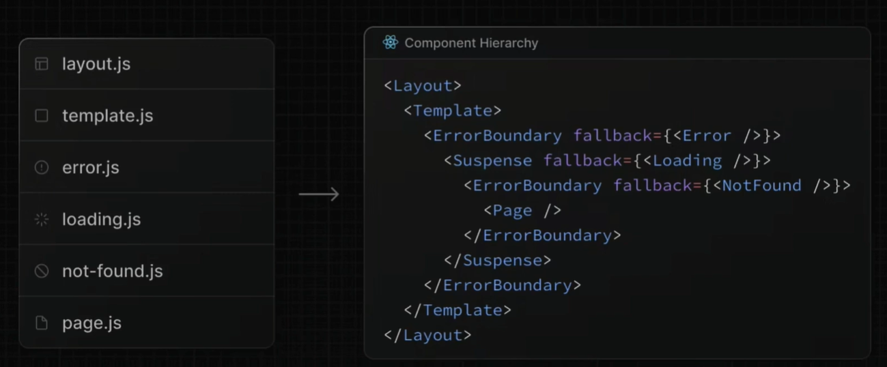

# Next.js

>
>`Next.js官方文档：https://nextjs.org/docs/app/building-your-application/caching`
>
>``

## 基础介绍

React服务端实现
- SSG: 静态站点生成
- ISR: 增量静态生成
- SSR: 服务端渲染
- API: api接口


`page.tsx`、`route.tsx`、`action.ts`
- page：显示的页面Page
- route: 后端控制器Controller
- action：后端服务方法Service

页面组件默认服务端渲染


核心依赖：
- `next`
- `react`
- `react-dom`


核心功能：
- Routing
- API routes
- Rendering
- Data fetching
- Styling
- Optimization
- Dev and prod build system


- 基于文件的路由系统，所有路由文件都必须放入app文件夹中
- 路由页面：`page.tsx`
- 布局页面：`layout.tsx`
- 模板页面：`template.tsx`
- 默认页面：`default.tsx`
- 404页面：`not-found.tsx`
- 加载页面：`loading.tsx`
- 异常处理：`error.tsx`
- API Handler：`route.tsx`
- 中间件：`middleware.ts`




路径别名：根目录`@/xxx`


自动图象、字体优化

### 项目结构
```yaml
项目结构:
    /.next:
        /cache:
        /server:
        /static:
        /types:
        build-manifest.json:
        package.json:
        trace:
    /public: # 静态资源目录
    /src:
        /app: # 前端路由页面
            /xxx:
            /(xxx): # 路由分组 无实际url
            /_xxx: # 私有文件夹
            /(..)xxx: # 路由拦截，上一级
            /[xxx]: # 动态路由
            /[...xxx]: # 动态匹配所有路由
            /[[...xxx]]: # 可选动态匹配所有路由
            /@xxx: # 并行命名路由、插槽路由
                default.tsx: # 默认插槽页面
            /api:
                /xxx:
                route.tsx:
                    dynamic: # 可配置动态缓存
                    dynamicParams:
                    fetchCache:
                    preferredRegion:
                    revalidate: # 缓存有效时间
                    runtime:
                    GET():
            default.tsx: # 默认插槽页面
            error.tsx: # 异常页面
                error:
                    message:
                reset():
            favicon.ico: # 网站icon
            global-error.tsx:
            globals.css: # 全局CSS
            layout.tsx: # 主布局页面
                metadata: # 页面元信息
                ---
                children: # 子组件渲染
            loading.tsx: # 加载页面
            not-found.tsx: # 缺省页面
            page.tsx: # 入口页面
                dynamic: # 动态页面配置
                dynamicParams: # 允许访问 generateStaticParams 以外的动态路径。未在 generateStaticParams 中定义的路径会 fallback 到服务器端渲染（SSR）
                metadata: # 页面元数据
                    description:
                    title:
                revalidate: # 页面重新验证，缓存刷新时间
                generateImageMetadata():
                generateMetadata(): # 动态生成页面元信息
                generateSitemaps():
                generateStaticParams(): # 生成静态path param参数，用于静态页面生成，通过params参数传递给组件
                getInitialProps(): # 
                getServerSideProps(): # SSR服务渲染页面 props
                    context:
                        params:
                        query:
                        req:
                        res:
                            setHeader():
                        resolvedUrl:
                generateViewport():
                getStaticPaths(): # 静态页面渲染组件 path params
                    ---
                    fallback:
                    paths:
                getStaticProps(): # 静态页面渲染组件 props
                    ---
                    props:
                    revalidate:
                ---
                params: # 页面参数
                searchParams:
                fetch(): # 异步获取数据
            template.tsx:
        /components:
        /lib:
        instrumentation.ts: # OpenTelemetry指标监控
        middleware.tsx: # 中间件定义
            config:
                matcher: # 中间件匹配器
                    source:
                    has:
                    missing:
                        type:
                        key:
                        value:
            middleware():
    .eslintrc:
    next-env.d.ts:
    next.config.js:
    package.json:
    postcss.config.json:
    tailwind.config.ts:
    tsconfig.json:
```


### next
```yaml
next:
    build: # 构建
    dev: # 开发
    export: # 静态页面生成
    lint:
    start: # 生产运行
```


#### create-next-app
```yaml
create-next-app: # next脚手架
    --typescript:
```

next脚手架
`npx create-next-app@latest`

#### next.config.js
```yaml
next.config.js:
    compiler:
        styledComponents:
    images:
        domains:
        remotePatterns:
            hostname:
            pathname:
            port:
    logging: # 日志
        fetches:
            fullUrl:
    reactStrictMode:
    redirects: # 请求重定向
        destination:
        permanent:
        source:
    sassOptions:
        additionalData:
```

next项目配置


## 核心内容
```yaml
next:
    cache: # 缓存
        revalidatePath(): # 刷新指定路径的缓存
        revalidateTag(): # 刷新指定标签的缓存，tag在fetch请求时动态设置
        unstable_cache(): # 用于封装缓存其它请求，比如ORM
            revalidate:
            tags:
    document: # nextjs页面结构组件
        Html:
        Head:
        Main:
    font: # 字体
        google:
            Geist:
            Inter:
            Geist:
        local:
            localFont: # 本地字体加载
                src:
                    path:
                    style:
                    weight: 
    form:
        Form:
    head:
        Head: # Head组件，可用于设置metadata元信息
    headers: # 请求头
        cookies(): # 请求头中的Cookie
            delete():
            get():
            set():
        draftMode():
        headers():
    image: # 图片
        Image: # 图片组件
            alt:
            src:
        StaticImageData:
    link: # 链接
        Link: # 页面跳转组件
            href:
            replace:
    navigation: # 导航
        notFound(): # 跳转到404页面
        permanentRedirect(): # 永久重定向
        redirect(): # 重定向响应
        userPathname(): # 获取url path（仅客户端组件）
        useRouter(): # 路由器、路由跳转（仅客户端组件）
            ---
            isFallback:
            query: # Query参数
            back():
            forward():
            prefetch(): # 预加载
            push(): # 页面跳转，栈上推送
            refresh():
            replace(): 
        useSearchParams():
        useSelectedLayoutSegment(): # 在layout中获取当前动态渲染的子页面
        useServerInsertedHTML():
    og:
        ImageResponse:
    router:
        useRouter():
    script:
        Script:
    server: # 服务端
        NextFetchEvent:
            waitUntil():
        NextRequest: # api请求，自带请求信息，不需要手动导入函数
            cookies: # Cookie
                delete():
                get():
                getAll():
                has():
                set():
            headers: # 请求头
                get():
            nextUrl:
                pathname:
                searchParams: # quey param参数
            url: # 请求url
        NextResponse: # api响应
            cookies:
            headers: # 响应头
                set():
            json():
            next(): # 中间件 放行
            redirect(): # 重定向
            rewrite(): # 重写、请求转发
            write(): # 流式写入
        after(): # 组件渲染完成 后置钩子
        connection(): # 阻塞等待连接
        userAgent(): # 获取浏览器代理UA
    AppProps:
    Headers:
    Request:
        formData(): # form 表单
        json(): # json请求体
        text():
    Response:
        json():
    Metadata: # 页面元信息
        title: # 页面标题
            absolute:
            default:
            template: # 多级metadata嵌套模板字符串
        description: # 页面描述
    NextApiRequest:
        method:
        query:
    NextApiResponse:
        json():
        status():
    NextConfig: # next项目配置
        compiler:
            styledComponents:
        images:
            remotePatterns:
        sassOptions:
            additionalData:
    fetch(): # next重写fetch请求
        next:
            cache: # 请求缓存
                force-cache:
            tags:
react: # React全局对象
    CSSProperties: # css样式属性
    FC: # 函数式组件
    FormEvent:
    PropsWithChildren:
    ReactElement:
    ReactNode: # jsx组件
    Suspense:
        fallback:
    cache():
    memo():
    startTransition():
    use(): # 使用异步Promise参数
    useActionState(): # 表单提交状态
        formAction:
        pending:
        state:
    useCallback():
    useOptimistic(): # 更新显示优化
    useRef(): # DOM引用
    useState(): # 状态
react-dom:
    useFormStatus(): # 获取当前表单状态
        pending:

next-auth: # /api/auth/[...nextauth].ts，设置认证提供者、回调函数、会话配置
    jwt:
        getToken(): # 触发jwt校验   
            req:
            ---
    middleware: # 中间件    
        default:
        withAuth():
            middleware():
    next:
        NextAuth: # 拦截 /auth/* 的 GET、POST的handle方法
            adapter: # 集成数据库
            callbacks: # 回调方法
                jwt: # ({ token, user })，认证成功设置token信息
                session: # ({ session, token })，认证成功设置session信息
            pages: # 自定义页面
                signIn: # 自定义登录页面
            providers: # 集成自定义认证、OAuth第三方 (github)
            session: # session配置
                strategy:
            ---
            auth():
            handlers():
            signIn():
            signOut():
    providers: # 认证提供
        credentials: # /api/auth/callback/credentials
            CredentialsProvider: # 自定义认证
                name:
                credentials:
                authorize(): # 自定义认证逻辑
        github: # /api/auth/callback/github
            GitHubProvider:
                clientId:
                clientSecret:
    react:
        SessionProvider:
            basePath:
            session:
        getCsrfToken():
        signIn(): # 登录认证，指定Provider处理
        signOut(): # 
        useSession(): # 前端使用session，触发jwt校验
            data:
            status:
    DefaultSession:
    Session:
    User:
next-connect: # 中间件串联
next-safe-action: # next api 自调用
    createSafeActionClient():
    useAction():
        onSuccess():
        ---
        status:
        execute():
@tanstack:
    react-query:
        QueryClient:
        QueryClientProvider:
            client:
        useQuery():
            queryFn:
            queryKey:
    react-query-devtools:
        ReactQueryDevtools:
react-content-loader:
react-hook-form:
zustand:
    middleware:
        devtools():
        persist():
    create():
```


### Routing

- `[id]`：动态路由匹配
- `[...id]`：多级匹配、匹配所有
- `(id)`：排除名称、路由分组（文件夹名不包含在路由内）
- `_id`：私有文件夹
- `@id`：layout插槽文件夹
- `(.)id`/`(..)id`/`(...)id`: 路由拦截文件夹


path params 通过函数参数传递进来


`page.tsx`：默认页面

`layout.tsx`：默认布局页面

当前及其子级的page.tsx文件都 会被放入layout.tsx文件中

layout插槽：`default.tsx`插槽默认页面

路由拦截：


#### Dynamic Route

动态路由，`[id]`


#### Private Route

私有文件夹，`_id`


#### Parallel Route

并行路由，`@id`
常用于modal模态框


#### Route Group

路由组，`(id)`


#### Loading

Streaming异步加载组件`<Suspence>`，`loading.tsx`


#### Error Handling

错误边界组件`<ErrorBoundary>`，`error.tsx`
error.tsx必须是客户端组件
- error
- reset()


通过prop中接收异常信息和重试函数

#### 404

not-found缺省路由，`not-found.tsx`


### Rendering

默认服务端组件

`use client`使用客户端组件

客户端渲染组件CSC、服务端渲染组件RSC

服务端组件不能使用state

客户端渲染组件的子级也是客户端渲染组件，尽量在叶子节点的组件上使用客户端组件


组件渲染顺序
- layout.js
- template.js
- error.js (React error boundary)
- loading.js (React suspense boundary)
- not-found.js (React error boundary)
- page.js or nested layout.js


#### Component
- Font字体
- Form表单
- Image图像
- Link链接
- Script脚本
- Suspense占位组件：可实现延迟加载


##### Form

form表单action可使用服务端的action函数
表单提交常配合`useActionState()`使用


#### Layout

实现内部React-Router效果、路由切换时会保存状态
layout.tsx可嵌套


#### Template

效果和Layout一样
路由切换时，Layout会保存状态，而Template不会


#### Styling

支持`.module.css`模块CSS、全局CSS


#### Directive 

组件渲染指令
- `'use server'`
- `'use client'`
- `'use cache'`

#### SSR


内置动态渲染辅助函数：
- `generateMetadata()`
- `generateStaticParams()`


#### ISR

增量静态构建，依赖nodejs运行时（静态导出单页面时不支持）
可在控制台查看当前请求是否命中ISR，


#### SSG


静态内容生成


### API Handler

```javascript
// route.tsx
export async function GET() {
    return new Response("xxx")
}

export async function POST(req: Request) {
    const data = await request.json()
    return new Response("xxx")
}

```  
page.tsx与route.ts存在冲突，优先显示route.tsx

route.ts的路由规则和page.tsx的规则一样

中间件Middleware

form表单的action可直接绑定API处理函数


#### Data Fetching

fetct()、ORM


#### Middleware
```javascript
// 中间件处理函数
export function middleware(req: NextRequest) {
    return NextResponse.redirect("/xxx")
}

// 中间件配置
export const config = {
    matcher: "/xxx" // 中间件匹配器
}

```

默认只能配置一个中间件
中间件在redirects in next.config.js配置重定向执行之后，组件渲染之前执行


#### Caching

缓存


#### Valication


`zod`


#### Authentication


`next-auth`

##### NextAuth
```yaml
auth:

```


### Configuring

配置优化


### Testing

测试


### Deploy

项目发布

#### Vercel


