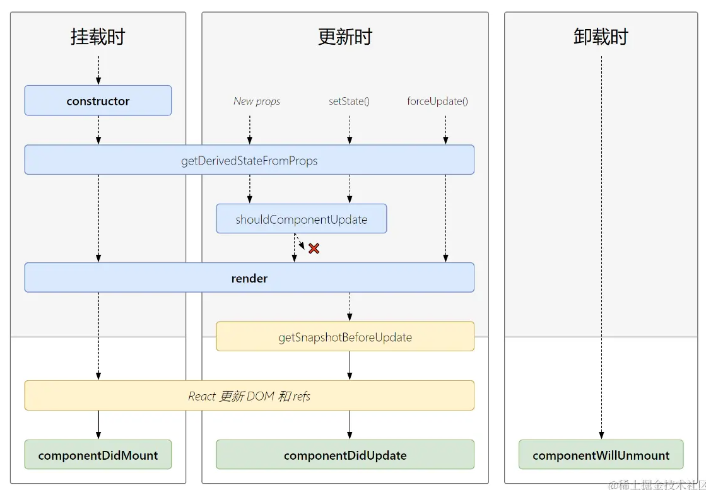

# React

`react官方文档：https://react.dev/learn`
`React 核心技术实践：P15`


## 基础介绍


Javascript 前端UI框架

基于JSX（声明式UI）语法、组件化


核心库：
- react
- react-dom
- react-scripts


`create-react-app`：react项目脚手架

`{ xxx }`：JSX模板语法（支持js表达式）
组件必须有一个根节点

可利用表达式实现：条件渲染（三元运算符、&&）、列表渲染（map()）

组件样式clasName：行内样式、类名样式、module css、

组件事件绑定：`onXxx`


### 项目结构
```yaml
项目结构:
    /public:
        favicon.ico:
        index.html: # 项目主页面
        robots.txt: 
    /src:
        App.js: # 项目主应用
        App.css:
        index.js: # 项目入口文件
        index.css:
    package.json:
```


### react-scripts
```yaml
react-scripts:
    build: # 项目打包
    eject:
    start: # 开发运行
    test:
```

React打包命令
react默认脚手架打包是带上map文件的


## 核心内容
```yaml
react: # react核心包
    Component: # 组件基类
        state:
        render():
        setState():
    Element: # React元素
    FC: # 函数组件
    ReactNode: # 任何可以被渲染的内容，包括字符串、数字、React 元素、数组或 fragment，常用于children
    StrictMode: # 严格模式，
    Suspense: # 异步加载组件
        fallback:
    act():
    cache():
    cloneElement(): # 元素复制，(element, props, ...children)，常用于扩展原有元素
    createContext(): # 创建Context
        Consumer: # 上下文消费者组件
        Provider: # 上下文提供者组件
            value:
    createElement(): # 创建DOM元素 (name, attrs, children)
    createRef(): # 原始DOM引用
        current:
    lazy(): # 动态导入组件，配合import()、Suspense使用
    memo():
    startTransition():
    use():
    useActionState():
    useCallback(): # 函数版计算属性，缓存函数的创建，根据依赖项绝对是否重新创建函数
    useContext(): # 使用上下文
    useDebugValue():
    useDeferredValue():
    useEffect():
    useId():
    useImperativeHandle():
    useInsertionEffect():
    useLayoutEffect():
    useMemo(): # 计算属性，缓存计算结果
    useOptimistic():
    useReducer(): # state仓库，用于管理多状态，(reducer, initialState)
    useRef(): # ref引用DOM
        current:
    useState():
    useSyncExternalStore():
    useTransition():
react-dom:
    client:
        ReactDOM: # React Dom 操作工具类（创建、渲染）
            createRoot():
                reander():
    render():
    useFormStatus():

@react-router/dev:
    routes:
        RouteConfig:
        index(): # 首页路由页面
        layout(): # 布局文件
        prefix(): # 路由前缀
        route(): # 路由页面，支持route()嵌套
react-router:
    Form:
    Links:
    Meta:
    Outlet:
    Scripts:
    isRouteErrorResponse():
    redirect():
react-router-dom: # v6
    BrowserRouter: # 浏览器路由器，不带#
        basename:
    HashRouter: # 哈希路由器，带#
    Link: # 连接，路由跳转组件
        to:
    Navigate:
    NavLink: # 带样式的路由跳转组件
        activeClassName:
        to:
    Outlet: # router-view，子路显示视图
    Redirect:
        to:
    Route: # 路由
        element: # 组件
        exact: # 精确匹配
        index: # 默认路由
        loader:
        path: # 路径
    RouterProvider: # 总route显示
        router:
    Routes: # 路由组，路由显示视图
    Switch:
    createBrowserRouter(): # 创建浏览器路由
        _options:
            basename:
        children: # 嵌套组件
        element:
        loader:
        path:
    createRoutesFromElements():
    useLocation(): # 路由导航信息
        pathname:
        state: # 路由传参
    useNavigate(): # 导航器
        replace:
        state: # 路由传参
    useParams(): # path param 路径参数
    useSearchParams(): # query param 查询参数
mobx:
    @action: # 定义响应式数据操作方法
        bound:
    @computed: # 定义计算属性
        observe():
    @observable: # 定义响应式数据
    computed: # 标注计算属性
    makeAutoObservable(): # 使类实例对象中的所有属性变成 响应式
    makeObservable(): # 
mobx-react:
    @observer: # 使组件可观测(响应状态变化更新)
mobx-react-lite:
    observer():

react-query:
@tanstack/react-query:
    QueryClient: # 查询客户端
        invalidateQueries():
            queryKey:
    QueryClientProvider: # 查询客户端 提供器
        client:
    useMutation():
        mutationFn:
        ---
        isPending:
        mutate:
            xxx(): # 自定义函数
    useQuery(): # 封装数据请求函数，缓存数据、自动重试
        enable: # 请求的条件
        gcTime:
        initialData:
        placeholderData:
        queryFn: # 请求函数
        queryKey: # 请求结果缓存key
        retry:
        refetchInterval:
        refetchOnMount:
        refetchOnReconnect:
        refetchOnWindowFocus:
        staleTime: # 数据缓存时间
        --- # hook 返回值
        data: # 函数返回数据
        dataUpdateAt:
        error: # 函数返回异常
        isError:
        isFetching:
        isLoading: # 数据加载中
        isRefetching:
        isState:
        refetch(): # 刷新数据
    useQueryClient():
        ---
        getQueryData(): # 获取缓存数据
        prefetchQuery(): # 预获取
@tanstack/react-query-devtools:
    ReactQueryDevtools:
redux:
    configureStore(): # 定义store
        reducer:
    createSlice(): # reducer：data、action
        name:
        initialState:
        reducers:
        ---
        actions:
        reducer:
react-redux: # 使用store
    Provider:
        store:
    useDispatch(): # 获取store方法
    useSelector(): # 获取store状态

styled-components:
    createGlobalStyle: # 全局样式
    keyframes: # 动画 
    styled: # dom元素
        a:
        div:
```


### 组件

- `<Fragment>`：`<>`空节点
- `<Profiler>`
- `<StrictMode>`
- `<Suspense>`


StrictMode：
- 检查不安全的生命周期方法（class 组件）
- 额外执行某些函数（如 useEffect）以帮助发现副作用

在 React.StrictMode 下，useEffect 里的回调会执行两次（仅限开发环境），这样可以检查是否有副作用
会警告已弃用的方法


#### 生命周期
```yaml
挂载阶段:
    constructor():
    render():
    componentDidMount():
更新阶段:
    render():
    componentDidUpdate():
销毁阶段:
    componentWillUnmount():
```




#### Props属性
```yaml
props:
    children:
```


props类型限定：`Xxx.propTypes`
props默认值：`Xxx.defaultProps`
（static静态属性）


#### 事件绑定
```yaml
事件绑定:
    onChange:
    onClick:
        nativeEvent:
        target:
        type:
        preventDefault():
```


#### 自定义组件
```jsx
// 自定义类组件
class MyComp extends React.Component {
    // 初始化状态，this.setState()修改状态
    state = { 
        name: "xxx"
    }
    render() {
        return <div>Sylvie233</div>
    }
}
```


函数组件、类组件

受控组件、非受控组件


### Hook
```yaml
```


#### useState
```jsx
const [data, setData] = useState(() => xxx)
```

创建状态属性：属性值、修改属性的方法

只能在函数最外层使用


#### useEffect
```jsx
function App(props) {
    useEffect(() => {
        ...
        return () => { /* 执行清理操作 */ }
    }, [
        xxx,
        () => xxx.xxx
    ])
}
```
实现生命周期、属性监听
提供副作用处理
默认每次组件渲染都会执行、初始化时会执行一次

在严格模式下，每次刷新都会执行两次


#### useReducer
```js
// 初始状态定义
const initialState = { data: null, loading: false, error: null };

// 统一状态处理
const reducer = (state, action) => {
  switch (action.type) {
    case 'FETCH_START':
      return { ...state, loading: true };
    case 'FETCH_SUCCESS':
      return { ...state, loading: false, data: action.payload };
    case 'FETCH_ERROR':
      return { ...state, loading: false, error: action.error };
    default:
      return state;
  }
};


// 创建reducer仓库
const [state, dispatch] = useReducer(reducer, initialState);

// 分发action，payload可用于传值
dispatch({ type: 'FETCH_SUCCESS', payload: data });
```

简易Redux实现


#### useRef

原始DOM引用


#### useContext

Context上下文值消费


#### Custom Hook

自定义钩子函数


### 组件通信


#### Props

属性传递、子传父通过传递方法实现
兄弟组件通信、状态提升


#### Context
```jsx
// 创建上下文
const {Provider, Consumer} = createContext():

// 提供者提供数据
<Provider value="xxx">

    {/* 消费者消费数据 */}
    <Consumer>
        {value => xxx}
    </Consumer>
<Provider>
```

可实现多级传递


### 组件样式


#### styled-components

原生样式组件、原生dom元素 + css的封装
支持元素嵌套、类less语法
支持混入、继承属性


### 组件路由
```jsx
// 1. 创建router
const router = createBrowserRouter([
  {
    path: "/",
    element: <div>Hello world!</div>,
  },
]);

// 2. App中注入Router
<React.StrictMode>
    <RouterProvider router={router}>
        ...
    </RouterProvider>
</React.StrictMode>


// 3. <Outlet>组件显示子路由
<Outlet />
```

React Router

- 声明式创建Router
- Provider注入Router
- Outlet显示内嵌路由视图


- `<Link>`
- `<BrowserRouter>`
- `<Routes>`
- `<Switch>`
- `<Route>`
- `<Outlet>`


- 基于定义：<BrowserRouter> （旧版语法）
- 基于配置：createBrowserRouter()


#### 路由声明
```jsx
// 基于定义的路由声明：
function App() {
    return (
        <BrowserRouter>
            <Link />

            <Routes>
                <Route path element />
                <Route path element>  {/* 嵌套路由的显示：<Outlet /> */}
                    <Route path element />
                </Route>
            </Routes>
        </BrowserRouter>
    )
}
```


#### 嵌套路由

`<Outlet />`：控制嵌套路由组件的显示


#### 编程式路由


##### useLocation

##### useNavigate

##### useParams

##### useSearchParams


### 状态管理

#### mobx
```jsx
import { makeAutoObservable, computed } from "mobx"
import { observer } from "mobx-react-lite"

// 1. 定义仓库
class Timer {
    secondsPassed = 0
    constructor() {
        makeAutoObservable(this, {
            // 计算属性
            myage: computed
        })
    }
    // 定义计算属性方法
    get myage() {
        return ths.secondsPassed + 1
    }
    increaseTimer() {
        this.secondsPassed += 1
    }
}

// 2. 实例化仓库
const myTimer = new Timer()

// 3. mobx包装自定义组件
const TimerView = observer(({ timer }) => <span>Seconds passed: {timer.secondsPassed}</span>)

// 4. 仓库对象实例 传入 实例化对象（props、context、直接导入）
ReactDOM.render(<TimerView timer={myTimer} />, document.body)

// 5. 调用仓库方法修改状态
setInterval(() => {
    myTimer.increaseTimer()
}, 1000)
```

observer() 包裹组件


#### zustand
```jsx
import { create } from 'zustand'

// 1. 创建仓库
const useStore = create((set) => ({
  bears: 0,
  increasePopulation: () => set((state) => ({ bears: state.bears + 1 })),
  removeAllBears: () => set({ bears: 0 }),
  updateBears: (newBears) => set({ bears: newBears }),
}))

// 2. 使用仓库
const bears = useStore((state) => state.bears)
const increasePopulation = useStore((state) => state.increasePopulation)
```


#### redux

store、reducer、action


## React原理


React组件渲染流程：
```txt
React Component (JSX) 
   ↓ 编译（Babel）
React.createElement(...) 
   ↓
Virtual DOM（VNode） 
   ↓ Render 阶段（Reconciliation）
Fiber 树（工作单元树） 
   ↓ Commit 阶段（提交变更）
DOM 真实节点（HTML 元素）
```