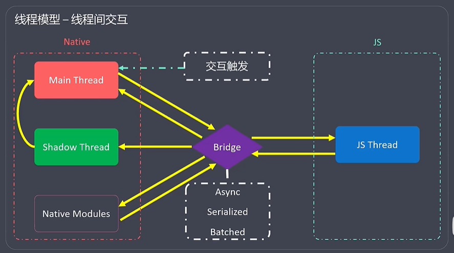
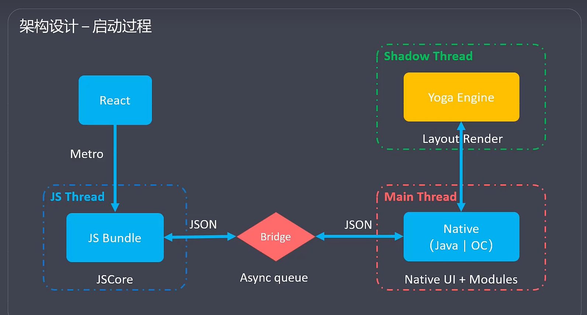
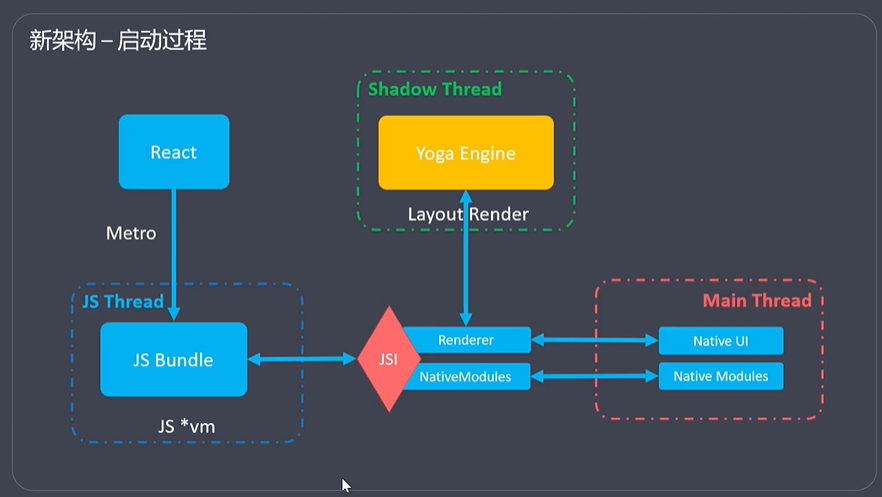

# ReactNative

``

## 基础介绍

React移动端解决方案

`create-expo-app`expo项目脚手架


Native -> Bridge -> JS







### 目录结构
```yaml
expo项目:
    /app:
    /assets:
    /components:
    /constants:
    /hooks:
    /node_modules:
    /scripts:
    app.json:
    babel.config.js:
    metro.config.js:
    package.json:
    tailwind.config.js:
    tsconfig.json:
```


#### app.json
```yaml
app.json:
    expo:
        android: # 安卓平台配置
            adaptiveIcon:
                backgroundColor:
                foregroundImage:
            package: # 主包名
            permissions: # 手机权限
                CAMERA:
                LOCATION:
            versionCode:
        assetBundlePatterns: # 资源文件打包
        extra: # 额外参数（环境变量）,可通过expo-constants获取
            apiBaseUrl: # 常配置api url
        icon: # 应用图标
        ios: # ios平台配置
        name: # 应用名称
        orientation: # 应用方向
            portrait: # 竖向
        scheme: # 自定义deeplink（URL Scheme）
        splash: # 启动画面、首屏广告
            backgroundColor:
            image:
            resizeMode:
        slug:
        updates: # 远程更新
            fallbackToCacheTimeout:
        userInterfaceStyle: # 深色/浅色模式
            automatic:
        version: # 版本
        web: # WEB平台配置
```


打包构建配置
控制应用的名称、图标、权限、依赖项


#### app.config.js

app.json的js配置版本


#### metro.config.js


#### eas.json
```yaml
eas.json:
    build: # 构建配置（多环境Profile）
        development:
        preview:
        production: # 生产环境
            android: # 安卓打包配置
                apk:
                app-bundle:
            distribution:
            ios:
    cli:
        version:
    submit:
        production:
            android:
                serviceAccountKeyPath:
```

eas服务配置

### react-native
```yaml
react-native:
    init:
    link:
    run-android:
    run-ios:
    start:
        --reset-cache:
```

旧react-native命令工具


### expo
```yaml
expo:
    build:
        --profile: # 指定配置环境Profile 
        android:
            -t: # apk
    init: # 初始化项目、脚手架
    install: # expo组件安装
    prebuild: # 预构建、生成原生项目
    publish: # 项目发布到expo
    start: # 开发服务器启动
        --android:
        --ios:
        a: # 安卓启动
        i: # ios启动
        w: # web启动
        e: # expo go启动
```


开发命令工具


#### eas
```yaml
eas:
    build: # 远程构建
        --platform:
        configure: # 生成 eas.json远程项目配置文件
    doctor: # 项目环境检测
    login: # 登录expo
```

打包命令工具


## 核心内容
```yaml
react:
    Component: # 类组件
    useState():
react-native:
    ActiveIndicator: # 加载指示器
        animating:
        color:
        size:
    Alert: # 提示框
        alert(): # 可设置多个item
            onPress: # 点击事件
            style:
            text:
    Animated: # 动画
        timing():
            options:
                duration:
                toValue:
                useNativaDriver:
            start(): # 开始动画
        Image:
        Text:
        Value: # 动画属性值
            setValue():
        View:
        ScrollView:
    AppRegistry:
        registerComponent(): # 主页面组件注册
    Button: # 按钮
        title:
        onPress:
    Dimensions: # 动态尺寸、媒体查询 
        addEventListener():
            change:
        get():
            screen:
            window:
                height:
                width:
    FlatList: # 高性能列表、列表渲染
        data: # 数据列表
        horizontal: # 水平方向
        initialNumberToRender:
        initialScrollIndex:
        ItemSeparatorComponent:
        ListEmptyComponent:
        ListFooterComponent:
        ListHeaderComponent:
        numColumns:
        keyExtractor: # key生成
        onEndReached:
        onRefresh:
        renderItem: # 渲染函数
    Image: # 图片
        source:
    ImageBackground: # 图片背景
    KeyboardAvoidingView:
    Modal: # 模态组件
        animationType:
            fade:
            slide:
        onRequestClose:
        presentationStyle:
            pageSheet:
        visible:
    NativeModules:
    Platform: # 平台，媒体查询
        OS: # 操作系统
        select():
            android:
            ios:
    Pressable:
        onLongPress:
        onPress:
        onPressIn:
        onPressOut:
    SafeAreaView: # 安全界面视图
    ScrollView: # 滚动视图
        contentContainerStyle:
        horizontal:
    SectionList: # 分组列表、支持下拉刷新、上拉加载
        ItemSeparatorComponent:
        keyExtractor:
        ListEmptyComponent:
        ListHeaderComponent:
        onEndReached:
        onEndReachedThreshold:
        onRefresh:
        renderItem: # 渲染函数
        renderSectionHeader:
        sections: # 列表数据
    Switch: # 开关按钮
        onValueChange:
        trackColor: # 背景色
        thumbColor: # 前景色
        value:
    StatusBar: # 状态栏
        backgroundColor: # 背景色
        barStyle: # 预设样式
        hidden: # 隐藏状态条
    StyleSheet: # css样式
        create():
    Text: # <p>
        style:
    TextInput: # 输入框
        keyboardType:
        multline: # 多行输入框
        numberOfLines:
        onChangeText: # 输入文本事件
        placeholder:
        secureTextEntry:
        value:
    TouchalbeHighlight:
    TouchalbeOpacity: # 点击透明
    TouchalbeWithoutFeedback:
    View: # <div>
        style:
    alert():
    useWindowDimensions():
@react-navigation:
    bottom-tabs: # 底部选项卡导航
        createBottomTabNavigator():
            Navigator:
                screenOptions: # 屏幕设置
                    route:
                    tabBarIcon: # 底部选项卡图标
                tabBarOptions:  
                    activeTintColor:
            Screen:
                component:
                name:
    drawer: # 抽屉导航
        createDrawerNavigator():
            Navigator:
            Screen:
    material-top-tabs: # 顶部选项卡导航
        createMaterialTopTabNavigator(): 
            Navigator:
            Screen:
    native: # 核心
        DartTheme:
        DefaultTheme:
        NavigationContainer: # 路由视图容器
        ThemeProvider:
        useNavigation(): # 编程式导航
            getParent(): # 获取父级导航器
            navigate():
            openDrawer():
            toggleDrawer():
    native-stack: # 核心， 堆叠Stack屏幕
        createNativeStackNavigator():
            Navigator: # 路由器
                headerMode:
                initialRouteName: # 初始路由
                screenOptions:
            Screen: # 屏幕视图
                component: # 组件
                    _navigation: # Screen组件 默认props接收navigation路由器
                        navigate():
                    _route: #
                        params: # 路由参数
                name:
                navigation: # 自动注入
                    navigate(): # 路由切换
                options:
                    headerLeft:
                    headerStyle:
                    title:
                route:
                    params:
    stack:
        createStackNavigator():
@react-native-async-storage: # 异步存储
    async-storage:
        AsyncStorage:
            clear():
            getItem():
            removeItem():
            setItem():
@react-native-community:
    geolocation:
        Geolocation:
            getCurrentPosition():
                options:
                    timeout:
@react-native-picker: # 下拉框
    picker:
        Picker:
            mode:
                dialog:
                dropdown:
            onValueChange:
            selectedValue:
            Item:
                label:
                value:
react-native-animatable: # 动画
    Animatable:
        View:
            animation:
react-native-camera: # 摄像头
    FaceDetector:
    RNCamera:
        Constants:
            FlashMode:
                on:
        flashMode:
        type:
        takePictureAsync():
react-native-gesture-handler:
react-native-image-picker: # 相册
    ImagePicker:
        showImagePicker():
            options:
                customButtons:
                storageOptions:
                title:
            response:
                didCancel:
                uri:
react-native-linear-gradient: # 线性渐变
    LinearGradient:
        colors:
        end:
        start:
react-native-swiper: # 轮播图
    Swiper:
        showButtons:
react-native-vector-icons: # 矢量图标
    IonIcons:
        name:
react-native-webview: # WebView
    WebView:
        source:
            html:
            uri:
        style:
```


### 组件


- 函数式组件
- 类组件

- 条件渲染：if
- 列表渲染：map、FlatList


#### 事件机制
```yaml
Event:
    onPress: # 点击事件
```

#### 生命周期

##### componentDidMount

##### componentDidUpdate

##### componentWillUnmount


#### 组件样式


##### StyleSheet

样式组件，不能直接使用CSS
组件样式不具有继承性、可传递多个对象


##### Animated

Animated中Text、View、ScrollView、Image可直接使用动画
动画播放依赖：动画函数(timing)、动画属性值(Value)


### Hook

#### useState

状态管理

#### useEffect

副作用钩子，挂载、数据监听


### 组件通信


#### Props


#### Context


### 状态管理

#### Zustand


#### Redux

Store -> Reducer -> Action


#### Mobx


### 组件路由
```jsx
import { NavigationContainer } from '@react-navigation/native';
import { createStackNavigator } from '@react-navigation/stack';

const Stack = createStackNavigator();

// 配置路由
const App = () => (
  <NavigationContainer>
    <Stack.Navigator>
      <Stack.Screen name="Home" component={HomeScreen} options={{ title: '首页' }} />
      <Stack.Screen name="Detail" component={DetailScreen} options={{ title: '详情页' }} />
    </Stack.Navigator>
  </NavigationContainer>
);
```


Navigator嵌套实现嵌套路由
每个navigator保存自己的navigate历史


#### NavigationContainer

路由容器

#### Navigator

NavigationContainer -> Navigator -> Screen(可嵌套Navigator)
- StackNavigator: 堆叠Stack
- TabNavigator: 选项卡Tab

常使用StackNavigator嵌套TabNavigator


#### Screen


### 原生模块


#### NativeModules


## Expo
```yaml
expo:
    metro-config:
        getDefaultConfig():
expo-av:
expo-background-fetch:
expo-camera:
expo-constants:
expo-contacts:
expo-device:
expo-file-system: # 文件访问
expo-font:
expo-gl:
expo-google-maps:
expo-image-picker:
expo-linking:
expo-location:
expo-media-library:
expo-notifications:
expo-permissions:
expo-router: # 基于文件结构的约定式路由，还是需要显式声明Screen
    Link: # 链接
        asChild:
        replace:
    Slot: # layout子组件插槽
    Stack: # 堆叠路由视图容器，Switch
        Screen: # 视图页面定义
            name: # 根据文件索引到指定组件
            options: 
    Tabs: # 底部选项组
        Screen:
            name: # 根据文件索引到指定组件
            options: 
                title: # 标题
        tabBar:
    useFocusEffect():
    useGlobalSearchParams():
    useSearchParams():
    useNavigation():
    useRouter():
        params:
        pathname:
        query:
        back():
        push():
        setParams():
    useSegments():
expo-secure-store:
expo-sensors:
expo-sharing:
expo-sms:
expo-splash-screen:
    SplashScreen:
expo-sqlite: # sqlite数据库访问
expo-status-bar:
    StatusBar: # 底部状态栏
expo-task-manager:
```


### 项目结构
```yaml
项目结构:
    /.expo:
    /app:
        /(tabs): # 底部选项卡
            _layout.tsx:
            xxx.tsx:
        _layout.tsx: # Stack Screen堆叠显式
        +html.tsx:
        +not-found.tsx:
    /assets:
    /components:
    /constants:
    /hooks:
    /node_modules:
    /scripts:
    app.json:
    babel.config.js:
    expo-env.d.ts:
    package.json:
    tsconfig.json:
```


### expo-av

音频播放

### expo-constants


### expo-camera

相机访问

### expo-font


### expo-linking

### expo-notifications

消息通知

### expo-permissions

动态权限

### expo-router

基于文件目录结构的路由，类似nextjs的路由管理、需要显式声明
支持动态路由、_layout布局


### expo-splash-screen


### expo-system-ui


### expo-web-browser
