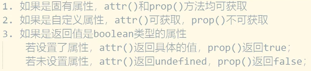

# jQuery

`jQuery官方文档：https://jquery.com/`

## 基础介绍

js dom操作库

包装DOM对象 -> jQuery对象


## 核心内容
```yaml
$:
    (): # 页面加载完成回调（返回jquery包装对象）
        _css_select: # CSS 选择器
            :animated:
            :contains():
            :disabled:
            :empty:
            :first:
            :has():
            :hidden:
            :input: # 输入表单元素
            :last:
            :not:
            :nth-child:
            :parent:
            :radio:
            :selected:
            :visible:
        [0]: # jquery对象转DOM对象
        addClass(): # DOM 添加css类
        after(): # DOM 插入所选元素后面
        animate(): # 动画 属性变化
            height:
            left:
            opacity:
            width:
        append(): # DOM 末尾添加子元素
        appendTo():
        attr(): # DOM 属性
        before(): # DOM 插入所选元素前面
        bind(): # 事件 （可同时绑定多个事件）
        children(): # 遍历 子元素
        click(): # 事件 点击
        clone():
        css(): # DOM 设置CSS属性
        dbclick():
        each(): # 遍历 遍历原始DOM对象 (index, element)
        empty(): # DOM 删除子元素
        eq(): # 遍历 查找指定索引的节点
        fadeIn(): # 动画 淡入淡出
        fadeOut():
        fadeTo():
        fadeToggle():
        filter(): # 遍历 过滤
        find(): # 遍历 查找子元素
        first(): # 遍历 查找的第一个元素
        get(): # DOM 对象
        hasClass():
        height(): # DOM 元素高度
        hide(): # 动画 隐藏
            slow:
        html(): # DOM 内部html页面代码
        innerWidth(): # DOM 元素内部宽度
        insertAfter():
        insertBefore():
        last(): # 遍历 查找的最后一个节点
        load(): # ajax
        next(): # 遍历 下一个兄弟节点
        not(): # 遍历 取反filter
        outerWidth(): # DOM 元素外部宽度
        on(): # 事件 事件绑定
            click:
        parent(): # 遍历 父元素
        parents():
        parentsUntil():
        position():
        prepend(): # DOM 开头添加子元素 
        prependTo():
        prev(): # 遍历 前一个兄弟节点
        prop(): # DOM 元素属性（true/false，无法获取自定义属性）
        ready(): # 事件 页面加载完成
        remove(): # DOM 删除元素
        removeAttr(): # DOM 删除元素属性attr
        removeClass(): # DOM 删除CSS类
        replaceWith():
        scrollLeft():
        scrollTop():
        show(): # 动画 显示
        siblings(): # 遍历 兄弟节点
        slideDown(): # 动画 滑动
        slideUp():
        slideToggle():
        stop(): # 动画 停止动画
        text(): # DOM 文本值
        toggle(): # 动画 显示切换
        toggleClass(): # DOM 切换CSS类
        val(): # DOM 表单value值
        width(): # DOM 元素宽度
    ajax(): # ajax异步请求
        url:
        data:
        success():
            res:
    get():
    post():
```

### 选择器
- #id选择器
- .class类选择器
- [attr]属性选择器 
- 表单选择器


### 元素遍历
- 父元素
- 子元素
- 兄弟元素


### DOM操作
- 添加元素
- 删除元素
- 修改元素属性
- css




### 事件绑定
1. 鼠标事件
    - click:
    - dbclick:
    - mouseenter:
    - mouseleave:
    - hover:
2. 键盘事件
    - keypress
    - keydown
    - keyup
3. 表单事件
    - submit
    - change
    - focus
    - blur
4. 窗口事件
    - load
    - resize
    - scroll
    - unload


### Ajax

ajax异步请求


### 动画
- 显示/隐藏
- 淡入淡出
- 滑动
- 动画属性
