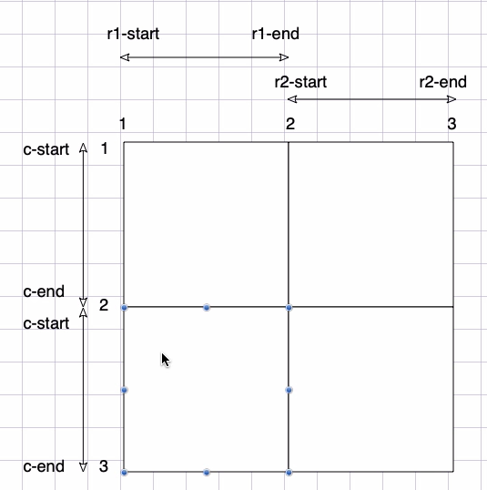

# CSS

`向军大叔CSS3教程：P152`

## 基础介绍


## 核心内容
```yaml
CSS3:
    @font-face: # 自定义字体
        font-family:
        src: # 字体文件
            format():
            url():
    @import: # 导入css文件
        url(): 
    @media: # 媒体查询 
    :hover:
    ::after:
    ::before:
        content: # 伪元素内容
    cacl(): # 属性值计算
    attr(): # 元素属性值获取
    align-items: # 弹性侧轴排列
        stretch:
    align-self: # 自身弹性侧轴排列
    background:
        no-repeat:
        linear-gradient(): # 线性渐变
        radial-gradient(): # 径向渐变
        repeating-linear-gradient(): # 重复线性渐变
        url():
    background-attachment: # 背景附件模式
        fixed:
    background-clip: # 背景裁切
        content-box:
    background-color: # 背景颜色
    background-image: # 背景颜色
        url():
    background-position: # 背景位置
    background-repeat: # 背景重复模式
        repeat:
        space:
    background-size: # 背景大小
        contain:
        cover:
    border: # 边框
    border-color: # 边框颜色
    border-collapse: # 边框合并
    border-radius: # 边框圆角
    border-spacing: # 边框间距
    border-style: # 边框样式
    bottom: # 定位底部位置
    box-shadow: # 盒子阴影
        rgba():
    box-sizing: # 盒子模型
        border-box: # 固定边框
    caption-side: # 表格标题位置
    clear: # 清除浮动
        both:
        left:
    clip-path: # 浮动显示区域
        circle():
    color: # 文字颜色
        rgb():
        rgba():
    column-gap: # 栅格列间距
    display: # 显示模式
        flex:
        grid:
        inline-flex:
        none:
        table: # 表格
        table-cap: # 表格标题
        table-footer-group: #
        table-header-group: #
        table-cell: # 表格列
        table-row: # 表格行
        table-row-group: #
    empty-cells: # 空表格单元格处理
        hide:
    filter: # 滤镜
        grayscale():
    fit-object:
    flex: # 弹性占比
    flex-basis: # 弹性基础尺寸
    flex-direction: # 弹性排列方向，默认水平
        column:
    flex-flow:
    flex-grow: # 弹性增长比例
    flex-shrink: # 弹性缩小比例
    flex-wrap: # 弹性换行 
    float: # 元素浮动
        left:
    font:
    font-family: # 字体
    font-size: # 字体大小
    font-style: # 字体风格
    font-variant: # 字体转换
        small-caps:
    font-weight: # 字体宽度
    grid-area: # 栅格区域定位
    grid-auto-flow: # 栅格流动方向
        dense: # 自动填充
    grid-column:
    grid-column-start: # 栅格列定位开始
    grid-column-end: # 栅格列定位结束
    grid-row:
    grid-row-start: # 栅格行定位开始
        span: # 相对偏移数
    grid-row-end: # 栅格行定位结束
    grid-template-areas: # 栅格区域设置，支持.占位
    grid-template-rows: # 栅格行设置
        fr: # 占比分配
        repeat():
            auto-fill:
            minmax():
    grid-template-columns: # # 栅格列设置
        repeat():
    height: # 元素高度
    justify-content: # 弹性主轴对齐方式
    left: # 定位左侧位置
    letter-spacing: # 字符间距
    list-style: # 列表样式
    list-style-image: # 列表样式图片
    list-style-type: # 列表样式类型
    line-height: # 行高
    margin: # 外边距
    max-height:
    max-width:
    min-height:
    min-width:
    object-fit:
        cover:
    opacity: # 透明度
    order: # 弹性模型顺序
    outline: # 轮廓线
    outline-color: 
    outline-style: # 轮廓线风格
    overflow: # 内容溢出处理
        hidden:
        scroll:
    padding: # 内边距
    place-content: # justify-content、align-items
    position: # 定位
        absolute:
        relative:
    right: # 定位右侧位置
    row-gap: # 栅格行间距
    shape-outside: # 环绕距离控制
        padding-box:
    text-align: # 文本对齐
    text-decoration: # 文本装饰
        underline:
    text-indent: # 文本缩进
    text-overflow: # 文本溢出
        ellipsis:
    text-shadow: # 文本阴影
    text-transform: # 文本转换
        uppercase:
    top: # 定位顶部位置
    transform: # 变换
        perspective(): # 透视
        rotateX(): # X旋转
        scale(): # 缩放
        skewX(): # 斜切
        translateY(): # Y平移
    transform-origin: # 变换锚点
        bottom:
    transition: # 过渡
    vertical-align: # 内容垂直对齐
    visibility: # 元素可见性
        hidden:
    white-space: # 空白处理
        nowrap:
        pre: # 代码风格
    width: # 元素宽度
        fit-content:
        cacl(): # 动态计算值
    word-spacing: # 单词间距
    writing-mode: # 排版模式
        vertical-lr:
    z-index:
```


### CSS variables

CSS变量

常用单位
- px
- em: 相对父级元素
- rem: 相对根元素


### Selector

- 标签选择器
- id选择器
- class类选择器
- 属性选择器
    - 属性值相等
    - 属性值前缀
    - 属性值后缀
    - 属性值包含
- 伪类选择器
    - :active:
    - :checked:
    - :disables:
    - :empty:
    - :enabled:
    - :first-child: 第一个子元素
    - :first-of-type: 第一个该类型元素
    - :focus:
    - :hover: 鼠标悬停
    - :invalid:
    - :last-chlid:
    - :last-of-type:
    - :link:
    - :not():
    - :nth-child():
    - :nth-last-child():
    - :nth-last-of-type():
    - :nth-of-type():
        - even:
        - odd:
    - :only-child:
    - :only-of-type:
    - :optional:
    - :root: html根元素
    - :required:
    - :target:
    - :visited:
    - :valid:
- 伪元素选择器
    - ::after:
    - ::before:
    - ::first-letter:
    - ::first-line:
- 通配符选择器
- 结构选择器
    - 后代选择器
    - 子元素选择器
    - 兄弟选择器
    - 紧随兄弟选择器


权重问题：
- inline style: 1000
- id: 0100
- class,property: 0010
- tag,pseudo: 0001
- *: 0000

继承的样式没有权重


### Layout

#### Box

盒子模型


#### Float


浮动只会对后面元素影响


#### Position

相对定位偏移占原空间、绝对定位偏移不占原空间
绝对定位依赖最近的相对定位（没有就相对页面根元素）

定位
- 相对定位
- 绝对定位
- 固定定位：相对根元素
- 粘性定位


z-index: 数值越大越在上面（动态调整实现切换效果）


#### Flex

弹性布局


#### Grid

栅格布局

基于栅格线、栅格区域名称定位
和flex弹性布局公用一套排版方案：`justify-content`、`align-items`


可对栅格线自定义命名



### Animation

动画


#### Transition

过渡


### 3D transforms


### Media Query
```yaml
@media:
    prefers-color-scheme: # 颜色模式
    width: # 宽度
```

媒体查询

### Filter

滤镜

#### Gradients

渐变


### SVG
```yaml
<svg>:
    <g>: # 分组
    <defs>: # 属性定义
        <filter>: # 过滤器
            id:
        <lineGradient>: # 线性渐变
            <stop>:
    <rect>: # 矩形
        x:
        y:
        rx:
        ry:
        width:
        height:
        fill:
        stroke:
        stroke-width:
    <circle>: # 圆形
        cx:
        cy:
        r:
    <ellipse>: # 椭圆
    <line>: # 线
        x1:
        y1:
        x2:
        y2:
    <polygon>: # 多边形
        points:
    <polyline>: # 多线条
        points:
    <text>: # 文本
        <tspan>: # 行内文本
        transform:
    <path>: # 路径
        d: # 命令
            M: # 移动
            L: # 绘制直线
            q: # 贝塞尔曲线
```