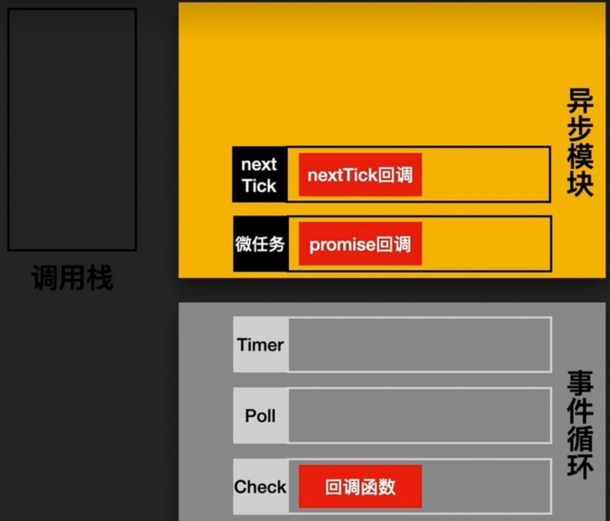
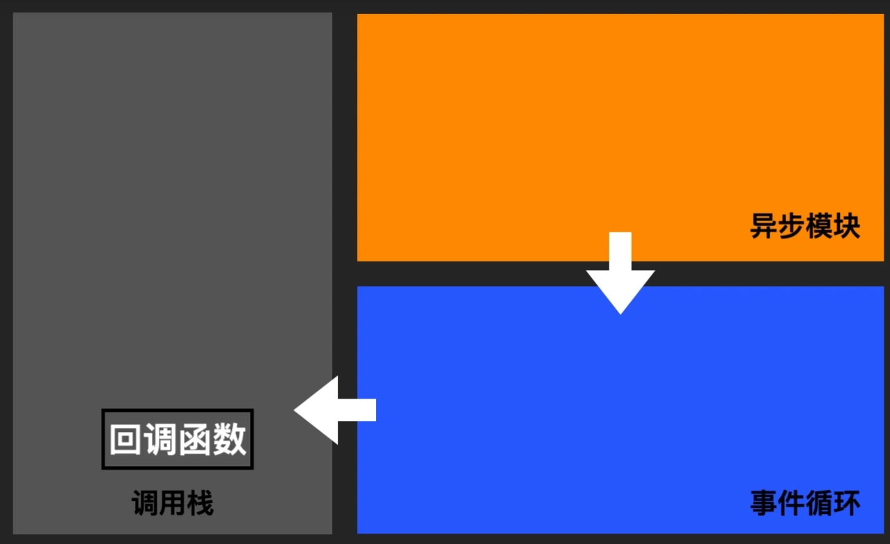
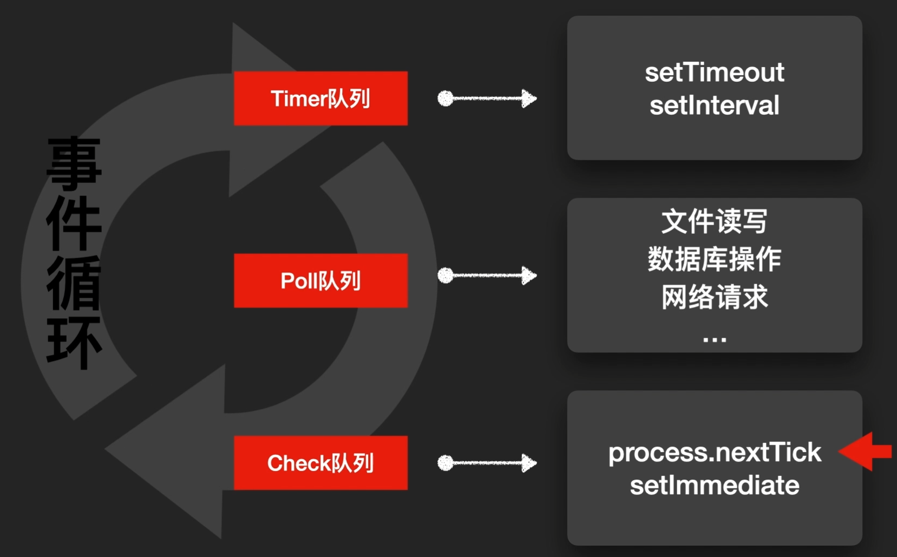

# NodeJs


## 基础介绍




### node
```yaml
node:
    -v: 版本
```


### npm
```yaml
npm:
    -v: 版本
    init: 初始化项目
    install: 安装
        -g: 全局安装
        --registry: 仓库
```

### package.json
```
{

}
```


## 核心内容


## 标准库

```yaml
std:
    builtin:
        __dirname: 目录名
        __filename: 文件名
        console:
        module: 模块
            children:
            exports: 模块导出对象
            filename:
            id:
            loaded:
            parent:
            path:
            paths:
        process: 进程对象
            env: 环境变量
            cwd(): 当前工作目录
            on():
        Buffer: 二进制对象
            length:
            alloc():
            from():
            slice():
            toString(): 转换为字符串
            write(): 
        Error: 错误对象
        JSON:
            stringify(): json字符串序列化
        Object:
            assign(): 对象赋值
        Promise:
            all():
        clearInterval(): 清除定时器
        require(): 导入函数
        setInterval(): 间隔定时器
        setTimeout(): 定时器
    crypto: 加密包
    events: 事件
        EventEmitter:
            emit(): 触发事件
            listeners():
            on(): 监听事件
            once(): 
    fs:
        promises:
        createReadStream(): 创建读取流
        createWriteStream():
        readFile():
        readFileSync(): 读取文件
        writeFileSync(): 写入文件
    http:
        Server: 服务
            listen():
        createServer(): 创建服务
    net:
        Server: 服务
    path:
        resolve(): 路径合并
    process: 进程
        argv:
        channel:
        stderr:
        stdin:
        stdout:
        exit():
        nextTick():
    stream:
        pipeline:
        Readable:
            "data|end|readable"
            pipe():
        Transform:
            _flush():
            _transform():
        Writeable:
            
    util: 工具包
    zlib: 压缩包
        createGzip():
        
```

### 异步模块




promise、async

- 定时器
- I/O操作
- Node内置


<br />
<br />
<br />


### 事件循环

事件循环：



