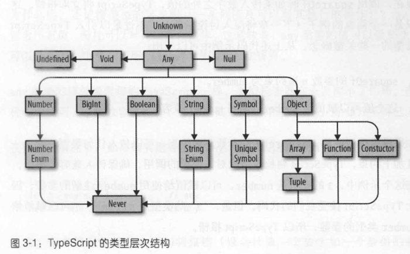
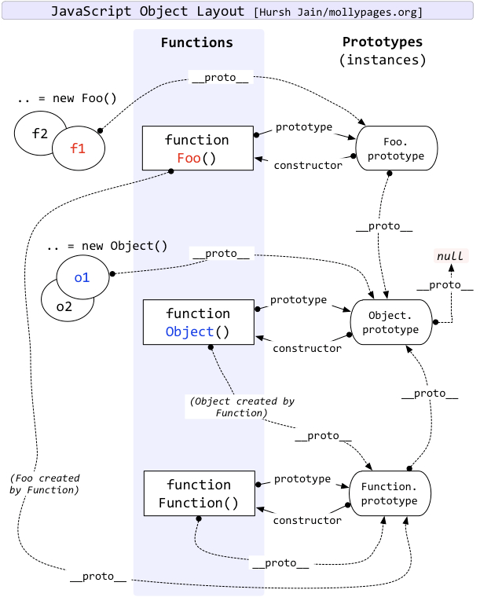

# TypeScript

>
>``
>

## 基础介绍


调试typescript先执行tsc编译且开启sourceMap
typescript可实现模板元编程


### tsc
```yaml
tsc:
    -d: # 生成.d.ts声明文件
    -h: # 帮助信息
    -m: # 指定模块版本信息
    -p: # 指定配置文件
    -v: # 版本
    -w: # 监听文件
    --build:
    --clean:
    --declaraion: # 生成声明文件
    --excludeFiles: # 排除编译文件
    --help:
    --init: # 初始化项目，生成配置文件tsconfig.json
    --module: # 指定生成的js模块系统
    --outDir: # 指定js编译输出目录
    --sourceMap: # 生成.map调试文件
    --strict: # 严格模式
    --target: # 指定编译的es版本
    --watch: # 开启监视模式
```

typescript编译命令

#### ts-node
```yaml
ts-node:

```

支持直接运行typescript的node


#### tsx
```yaml
tsx:

```

ts-node替代品


#### tsconfig.json
```yaml
tsconfig.json:
    compilerOptions: # 编译选项
        allowJs: # 编译js文件
        declaration: # 编译生成.d.ts声明文件
        emitDecoratorMetadata:
        experimentalDecorators:
        lib: # 使用的内置库
            DOM:
            ES2015:
        mapRoot: # 生成sourcemap的目录
        module: # 使用的模块系统
            commonjs:
        noImplicitAny: # 禁止隐式推导any
        noUnusedLocals: # 未使用的局部变量
        outDir: # 输出目录
        rootDir: # 源码目录
        skipLibCheck: # 跳过库文件的类型检查
        sourceMap: # 生成SourceMap调试映射文件，调试时开启
        strict: # 严格模式
        strictNullChecks: # 空类型检查
        target: # 编译的JS目标版本
            :es5:
    exclude: # 排除编译文件
    fils: # 包含编译文件
    include: # 指定编译文件
```


## 核心内容
```yaml
TypeScript:
    any: # 任意类型
    boolean: # 布尔
    enum: # 枚举
    never: # 所有类型子类
    number: # 数字
    object: # 对象
    string: # 字符串
        toUpperCase():
    symbol:
    unknown: # 更为严格的any
    void:
    Array: # 数组
        fill(): # 填充
        push():
        reduce():
    Map:
        get():
        set():
    Math:
    Number:
    Date:
    Error: # 异常
    IArguments: # 函数arguments对象
    Object: # 对象
        getOwnPropertyNames():
        getOwnPropertySymbols():
        keys():
    Promise:
    Proxy:
    ReadonlyArray: # 只读数组
    Reflect: # 反射
        ownKeys():
    RegExp:
    Set: # 集合
        add():
        clear():
        delete():
        has():
    Symbol: # 唯一符号
        iterator: # 迭代器
        for():
    Tuple: # 元组（固定元素的数组）
    WeakMap:
    WeakSet:
    fetch():
    import():

BOM:
    Location:
    Storage:
    XMLHttpRequest:

DOM:
    Element:
    HTMLCanvasElement:
        height:
        width:
        getContext(): # 获取上下文类型
            fillStyle:
            fillRect():
            fillText():
    HTMLDivElement:
    HTMLInputElement:
    NodeList:
    NodeListOf:
```

### 数据类型
```yaml
DataTypes:
    any: # 顶层类型
    bigint: # 字面量以n结尾
    boolean:
    interface:
    never: # 所有类型子类
    null:
    number: 
    object: # 非原始类型
    string:
    symbol: # 唯一符号
    undefined:
    unknown: # 顶层类型
    void: # 空类型
    Array:
    Function:
    Infinity: # 无穷大
    NaN: # 非数字类型
    Object: # 顶层基类
    Symbol:

Utility Types: # 工具类型
    extends: # 类型约束，可用于type三元运算
    infer: # 类型引用
    in: # 遍历联合类型
    keyof: # 取出key的联合类型
        as: # 类型别名，可用于条件判断
    typeof:
        number:
    Awaited: # Awaited<T>获取 Promise<T> 解析后的类型
    ConstructorParameters: # ConstructorParameters<T>获取构造函数的参数类型
    Exclude: # Exclude<T, U>从 T 中排除 U 类型，用于联合类型
    Extract: # Extract<T, U>从 T 中提取 U 类型，用于联合类型
    InstanceType: # InstanceType<T>获取构造函数返回的实例类型
    NonNullable: # NonNullable<T>移除 null 和 undefined
    Omit: # Omit<T, K>从 T 中移除 K 这些属性，用于对象属性
    OmitThisParameter: # OmitThisParameter<T>移除函数的 this 参数
    Parameters: # Parameters<T>获取函数参数的类型
    Partial: # Partial<T>将类型的所有属性变为可选
    Pick: # Pick<T, K>从 T 中选择 K 这些属性，用于对象属性（K常用联合类型）
    Readonly: # Readonly<T>将类型的所有属性变为只读
    Record: # Record<K, T>创建一个以 K 为键、T 为值的对象类型
    Required: # Required<T>将类型的所有属性变为必填
    ReturnType: # ReturnType<T>获取函数返回值的类型
    ThisParameterType: # ThisParameterType<T>获取函数的 this 类型
```


5中特殊类型：


支持可空类型`?:`、只读属性`readonly`
ts能进行自动类型推断
enum枚举
interface、type自定义数据类型
支持联合数据类型|、交叉数据类型&(合并)





- 所有类型是`any`的子类型
- `unknown`与any一样，但unknown不能直接使用，需要typeof判断类型后使用
- `never`是所有类型的子类型
（any|unknown类似全集，never类似空集）


Type Aliase类型别名：通过`type`关键字定义类型别名
变量限定：`var`、`const`、`let`


#### String


#### Array
```typescript
// 直接声明
let arr1: number[] = [1, 2, 3];
```

动态数组

`...`扩展运算符（底层基于iterator迭代器实现）


#### Tuple
```typescript
// 元组声明
let tuple: [string, number] = ["Alice", 25];
```

元组
固定长度的数组


#### Set


#### Map


#### Enum

枚举
const常量枚举

可通过索引获取key


#### Utility Types


### 控制流程
```yaml
Control Flow:
    ?:: # 可空类型
    as: # 类型断言
    class: # 类定义
        constructor: # 构造方法定义
        extends: # 继承
        get:
        implements: # 接口实现
        private: # 私有
        protectd: # 保护属性，类及其子类可见
        public: # 公开属性
        readonly: # 只读属性
        set:
        static: # 静态
        super: # 父类实例引用
        this: # 自身实例引用
    const: # 常量
    declare: # 声明文件
        class:
        const:
        enum:
        function:
        global: # 扩展全局作用域
        interface:
        let:
        module: # 声明模块
        namespace:
        type: # 声明类型别名
        var:
    enum: # 枚举
    infer: # 泛型参数推导（常配合extends使用）
    instanceof: # 实例判断（关键字）
    let: # 局部变量
    keyof: # 获取键（关键字）
    readonly: # 只读属性
    satisfies: # 类型断言
    type: # 定义类型别名
    typeof: # 获取变量类型（关键字）
    for ... of ...: # 迭代器遍历
```


#### Exception Handler

异常处理


### 函数


Function

支持默认参数、可选参数、变长参数
可进行函数重载、声明可有多个，实现只能有一个

支持类型守卫


#### Generator

生成器


#### Generics

泛型

泛型约束：`<T extends K>`
可利用`keyof`进行遍历


### 面向对象

实例、函数(构造函数)、原型对象、原型链`__proto__`、null
实例和构造函数都指向原型对象、原型对象默认只有一个constructor指向构造函数



成员函数第一个参数可为`this`，用于自身实例的引用

`constructor`：定义构造方法
`this`：自身实例引用
`super`：父类实例引用


#### Abstract Class

抽象类


#### Interface

严格类型定义

重名接口声明，属性复合
接口继承`extends`

##### Index Signature


##### Function Signature


#### Decorators


##### ClassDecorator
```ts
const mydec: ClassDecorator = (target) => {
    ...
    target.prototype...
} 
```

类装饰器、传入类构造函数


##### PropertyDecorator

属性装饰器：`(target, propertyKey)`


##### MethodDecorator
```yaml
MethodDecorator:
    target:
    propertyKey:
    descriptor:
        value: # 方法本身
```

方法装饰器：`(target, propertyKey, descriptor)`

传入原型对象、方法名、方法描述符


##### ParameterDecorator

方法参数装饰器：`(target, propertyKey, parameterIndex)`
方法原型对象，方法名，参数索引 


#### Generics


### 模块


#### Namespace

命名空间


### 声明文件
```typescript
declare module "模块名称" {
    export let obj : {}
    export function func(arg: type): retType
}

declare global {} // 用于在全局作用域中声明
```


- type: 定义类型别名
- interface: 定义对象形状
- enum: 定义枚举
- namespace: 定义命名空间
- import/export: 模块导入导出

`.d.ts`：类型声明文件，为现有的javascript库提供类型注解
`/// <reference path="..." />`：引入声明文件依赖@types

声明文件放置位置：
- node_modules/@types
- tsconfig.json中的typeRoots、include、files
- 和原文件放置在一起
- 手动import引入
- /// <reference path="..." /> 三斜杠指令手动引入声明文件


